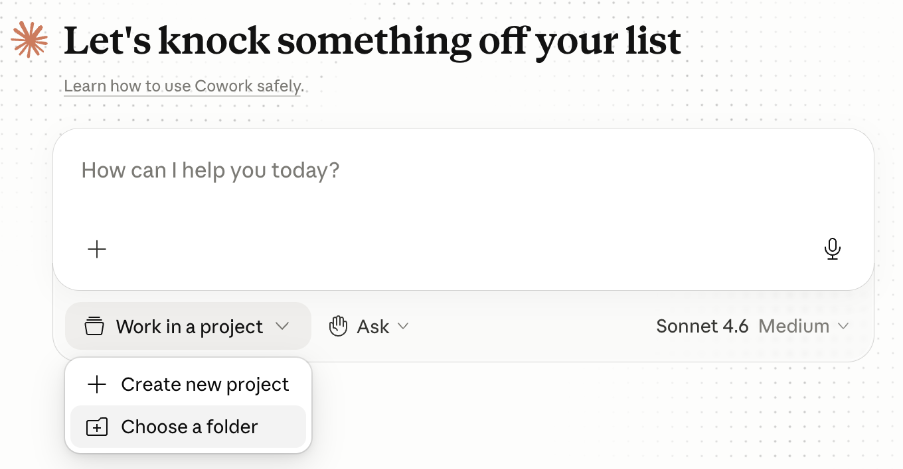
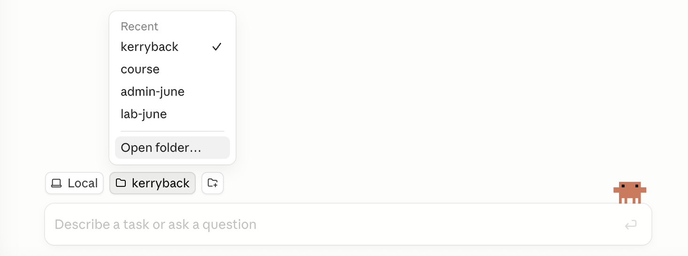
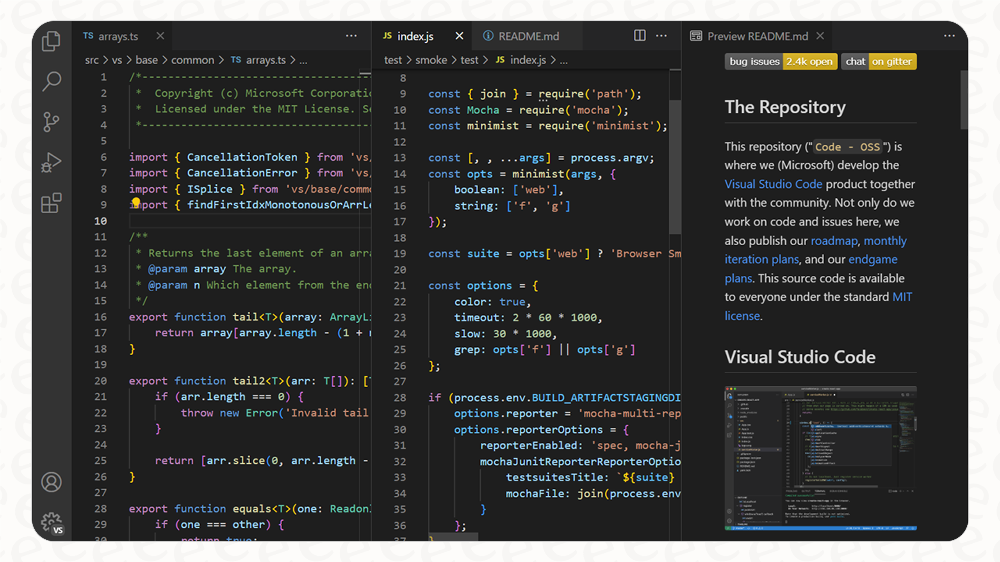

## Same Claude, Many Doors

::: {.two-cards}
::: {.card .card-blue}
[One model, many surfaces]{.card-title}

- The same Claude runs behind a chat window, inside Excel, and in your terminal
- What changes is *where it runs* and *what it can touch*
- A Pro account ($20/month) opens all of it
:::
::: {.card .card-amber}
[Today's map]{.card-title}

- The three modes: [Chat, Cowork, Code]{.accent}
- Claude Code in the terminal and in VS Code
- Claude for Excel, and choosing a model
:::
:::

::: {.explainer}
The goal is to know which door to walk through for a given job --- and what each one lets Claude do on your behalf.
:::

## The Three Modes {.section-divider}

## Chat, Cowork, Code

::: {.three-cards}
::: {.card .card-blue}
[Chat]{.card-title}

- The familiar chatbot
- Runs Python [in the cloud]{.accent}, in a sandbox
- Upload files, download results --- nothing on your machine is touched
:::
::: {.card .card-amber}
[Cowork]{.card-title}

- Agentic work on your files
- Runs in a [virtual machine]{.accent} mounted on a folder you choose
- Nothing outside that folder is visible or touchable
:::
::: {.card .card-teal}
[Code]{.card-title}

- Claude Code, [on your computer directly]{.accent}
- Runs terminal commands, installs software, reaches the internet
- The folder you open is where it starts --- it can work beyond it
:::
:::

::: {.explainer}
Same Claude, three places it can run code: the cloud, a VM, or your machine. The mode decides what it can see and touch --- which is a security decision as much as a convenience one.
:::

## What Each Mode Can Touch

::: {.comparison-table}

| Capability | Chat | Cowork | Code |
|---|---|---|---|
| Run code | ✓ (cloud) | ✓ (VM) | ✓ (your machine) |
| Web access | ✓ | — | ✓ |
| Read your local files | upload only | folder only | ✓ |
| Write / edit local files | — | folder only | ✓ |
| Run terminal commands | — | — | ✓ |
| Skills, connectors | ✓ | ✓ | ✓ |

:::

::: {.explainer}
Reach grows left to right --- and so does what you are trusting it with. Match the mode to the task and to the sensitivity of the data.
:::

## Opening a Folder

In Cowork and Code, you open a folder to give Claude access to your local files.

::: {.two-cards}
::: {.card .card-blue}
[Cowork]{.card-title}

Click *Work in a project* at the bottom of the chat, then *Choose a folder*

{width=90%}
:::
::: {.card .card-amber}
[Code]{.card-title}

Click the folder icon in the toolbar, or use the dropdown → *Open folder...*

{width=90%}
:::
:::

## Claude Code {.section-divider}

## In the Terminal and in VS Code

::: {.two-cards}
::: {.card .card-blue}
[The `claude` command]{.card-title}

- Claude Code is also a terminal program --- type [claude]{.shell-cmd} and start working
- Same engine as the Code tab in Claude Desktop
- This is how developers run it, and how we deploy things
:::
::: {.card .card-amber}
[The VS Code extension]{.card-title}

- VS Code is the standard free code editor
- The Claude extension puts Claude in a side panel, aware of your open files
- It shows proposed edits as a [diff]{.accent} you approve before anything changes
:::
:::

::: {.explainer}
For research work you will mostly live in VS Code with Claude beside you --- editing scripts, running notebooks, and reviewing every change before it lands.
:::

## Claude Editing Your Code

{width=82% fig-align="center"}

::: {.explainer}
Claude proposes a change; you see exactly what it added and removed, in green and red, and accept or reject it. Nothing is edited silently.
:::

## Claude for Excel {.section-divider}

## A Chat Panel Inside Excel

{width=84% fig-align="center"}

::: {.explainer}
The Claude add-in puts a chat panel directly inside Excel. You describe what you want --- formulas, tables, charts, an amortization schedule --- and Claude builds it in the active sheet. No Python, no terminal. Install it from the Microsoft Office Add-ins store.
:::

## Coming Day 3: Make It Yours

::: {.three-cards}
::: {.card .card-blue}
[Skills]{.card-title}

Teach Claude your procedures once --- it follows them the same way every time
:::
::: {.card .card-amber}
[Connectors]{.card-title}

Plug Claude into your data and systems, safely --- the MCP standard
:::
::: {.card .card-teal}
[Plugins]{.card-title}

Bundle skills and connectors into one package to share with a team
:::
:::

::: {.explainer}
You have seen *where* Claude runs and *how* to reach it. Skills, connectors, and plugins are how you customize it to your work --- they get their own session on Day 3.
:::

## Choosing a Model

::: {.comparison-table}

| Model | Best for | Cost |
|---|---|---|
| Haiku | Fast, simple, high-volume tasks | Lowest |
| Sonnet | The everyday default --- fast and capable | Middle |
| Opus | The hardest reasoning and coding | Highest, burns quota fastest |

:::

::: {.explainer}
A dropdown below the prompt lets you pick. Use Sonnet to conserve your quota; reach for Opus when a task is genuinely hard. The cheaper models are remarkably good now.
:::

## The Map {.centered-statement}

::: {.card .card-dark}
One Claude, reached through many doors: [Chat, Cowork, Code]{.accent} for how much of your machine it touches; the terminal and [VS Code]{.accent} for real work; and [Excel]{.accent} for spreadsheets. Day 3 adds [skills, connectors, and plugins]{.accent} --- your procedures and your data.
:::

## Breakout {.section-divider}

## Questions to Discuss

- For your own work, which mode fits best --- the sandboxed Chat, the folder-bounded Cowork, or the full-access Code?
- Where does the extra reach of Code mode make you cautious --- and what would make you comfortable?
- What is the first thing you would ask the Claude panel inside Excel to build?
- When would you switch from Sonnet to Opus --- and how would you know it was worth the quota?
