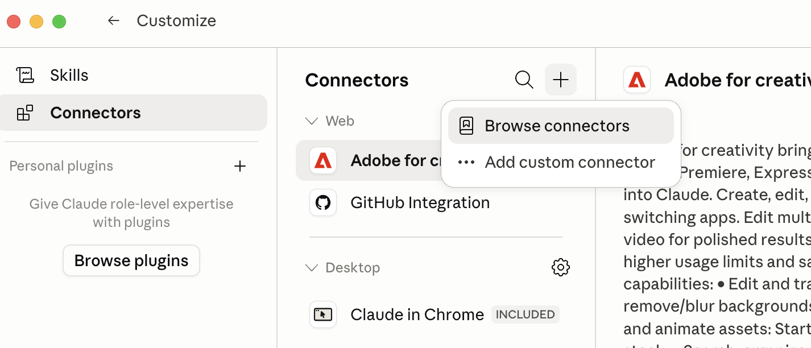

## Three Ways to Extend Claude

::: {.three-cards}
::: {.card .card-blue}
[Skills]{.card-title}

- Teach Claude *your procedure* for a task
- It follows the same steps every time
:::
::: {.card .card-amber}
[Connectors]{.card-title}

- Give Claude *your data and systems*
- Ask a database, your calendar, your files
:::
::: {.card .card-teal}
[Plugins]{.card-title}

- *Bundle* skills and connectors into one package
- Install once; share a whole setup with a team
:::
:::

::: {.explainer}
The model is fixed. What you change is what it *knows how to do* (skills), what it *can reach* (connectors), and how you *package and share* both (plugins).
:::

## Skills {.section-divider}

## Codified Expertise, Not a Smarter Model

::: {.two-cards}
::: {.card .card-blue}
[The problem with chatting]{.card-title}

- A great prompt works once, then scrolls out of your history
- The next person --- or the next you --- starts over
- Quality depends on remembering how you did it last time
:::
::: {.card .card-amber}
[What a skill fixes]{.card-title}

- Write down "how to do this well," once
- Every future run follows it --- same standard, no reminding
- A [one-time workflow]{.accent} becomes a [reusable asset]{.accent}
:::
:::

::: {.explainer}
A skill is not a model upgrade. It is your procedure, written down where Claude will follow it every time --- across Claude.ai, Claude Code, and the add-ins.
:::

## What a Skill Actually Is

::: {.two-cards}
::: {.card .card-blue}
[A folder and a file]{.card-title}

- A `SKILL.md` file: a name, a description, and instructions in plain English
- Optional scripts and reference documents alongside
- That is the whole thing --- readable, editable, versionable
:::
::: {.card .card-amber}
[How Claude uses it]{.card-title}

- At startup it reads only each skill's name and description
- When a task looks relevant, it pulls in the full instructions
- Scripts run only when needed --- so your context stays lean
:::
:::

::: {.explainer}
This "progressive disclosure" is why you can have dozens of skills installed and pay attention-cost only for the one in use.
:::

## Three Ways a Skill Fires

::: {.three-cards}
::: {.card .card-dark}
[Slash command]{.card-title}

You type [/critique]{.shell-cmd} or [/pptx]{.shell-cmd} to invoke it directly
:::
::: {.card .card-light}
[Natural language]{.card-title}

You ask in plain English and Claude runs the matching skill
:::
::: {.card .card-dark}
[Automatic]{.card-title}

"Create an Excel file" triggers the Excel skill on its own --- Claude reads each skill's description and picks
:::
:::

::: {.explainer}
Because each skill carries a short description Claude always sees, it knows which ones exist and when to reach for them --- without you naming them.
:::

## Build Your Own {.section-divider}

## From Workflow to Skill

::: {.two-cards}
::: {.card .card-blue}
[The easy path]{.card-title}

- Type [/skill-creator]{.shell-cmd} and describe your workflow
- It writes the `SKILL.md` and saves it where Claude will find it
- Invoke it by name from then on
:::
::: {.card .card-amber}
[Bake in the checks]{.card-title}

- Put your verification steps *inside* the skill
- "After computing, show the row count and the min and max"
- The skill enforces your standard, every run --- not just when you remember
:::
:::

::: {.explainer}
The best skills encode not just what to do, but how to *check* it --- your discipline, made automatic.
:::

## Two Skills You Might Write

::: {.two-cards}
::: {.card .card-blue}
[Teaching]{.card-title}

Turn a problem set into a solution key, a grading rubric, and three fresh variants --- formatted your way, every time
:::
::: {.card .card-amber}
[Research]{.card-title}

Audit a replication package: run the code, check each table against the paper, report what does not reproduce
:::
:::

::: {.explainer}
A hand-written skill --- yours, transparent, under your control --- is safer and more teachable than a multi-skill black box you did not read.
:::

## Connectors {.section-divider}

## Plugging Claude Into Your Systems

::: {.two-cards}
::: {.card .card-blue}
[MCP: the universal plug]{.card-title}

- A [connector]{.accent} links Claude to an outside service --- a database, your email, a document store
- The standard is MCP, the Model Context Protocol
- MCP is to AI what USB is to devices: one way to plug anything in
:::
::: {.card .card-amber}
[What it enables]{.card-title}

- "Ask our enrollment database in plain English"
- "Check my calendar and draft the replies"
- Add from a directory of ready-made connectors, or point it at your own
:::
:::

::: {.explainer}
Connectors are how Claude stops being a general assistant and starts knowing *your* data --- safely and centrally, rather than through copy-paste.
:::

## Adding a Connector

{width=70% fig-align="center"}

::: {.explainer}
A connector needs a name and an address; sensitive ones authenticate the way any app does --- an API key, or a corporate single sign-on. Once added, its tools are available in every chat.
:::

## Plugins {.section-divider}

## Bundling It All to Share

::: {.two-cards}
::: {.card .card-blue}
[What a plugin is]{.card-title}

- A single installable package that can bundle several pieces at once
- The way a team distributes a shared setup --- everyone installs one thing
- [/plugin install]{.shell-cmd} and you have the whole kit
:::
::: {.card .card-amber}
[What it can contain]{.card-title}

- Skills, custom agents, connectors (MCP servers)
- Hooks and output styles that shape behavior
- Skills are for *you*; plugins are for a *team*
:::
:::

::: {.explainer}
For your own work, a skill is enough. When a department wants everyone working the same way, a plugin ships the whole standard in one command.
:::

## Vetting {.section-divider}

## Installing Someone Else's Runs Their Code

::: {.two-cards}
::: {.card .card-red}
[The supply-chain risk]{.card-title}

- A shared skill, connector, or plugin runs someone else's instructions and scripts on your machine
- Many live in independent repos, outside Anthropic's screened directory
- There is active security research on malicious third-party skills
:::
::: {.card .card-teal}
[Due diligence]{.card-title}

- [claude plugin validate]{.shell-cmd} checks *structure*, not safety
- Read the `SKILL.md` and any scripts yourself
- Fine for a class demo; think twice before pointing it at real data
:::
:::

::: {.explainer}
"Validate" confirms a package is well-formed, not that it is trustworthy. The safest skill is often the small one you wrote and can read in full.
:::

## The Payoff {.centered-statement}

::: {.card .card-dark}
[Skills]{.accent} turn your best practice into something Claude does the same way every time. [Connectors]{.accent} give it your data instead of a copy-paste. [Plugins]{.accent} hand a colleague the whole setup in one command. You keep the judgment; they carry the discipline.
:::

## Breakout {.section-divider}

## Questions to Discuss

- What is one task --- teaching or research --- you do the same careful way each time, a good candidate for a skill?
- What system or dataset would you most want to *ask* in plain English --- a good connector to build?
- Would you install a colleague's skill or plugin? What would you read before trusting it with your data?
- If your department adopted one shared plugin, what should be in it?
