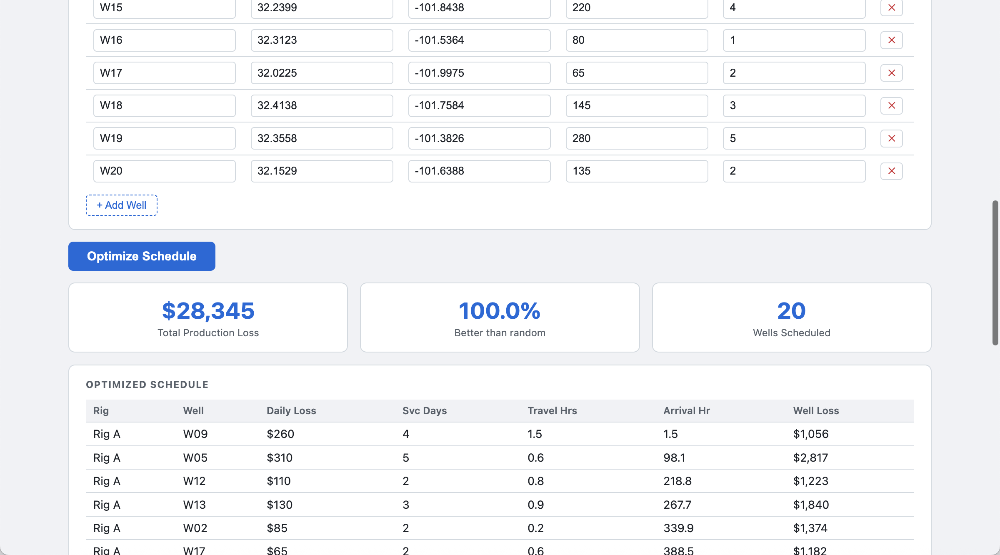
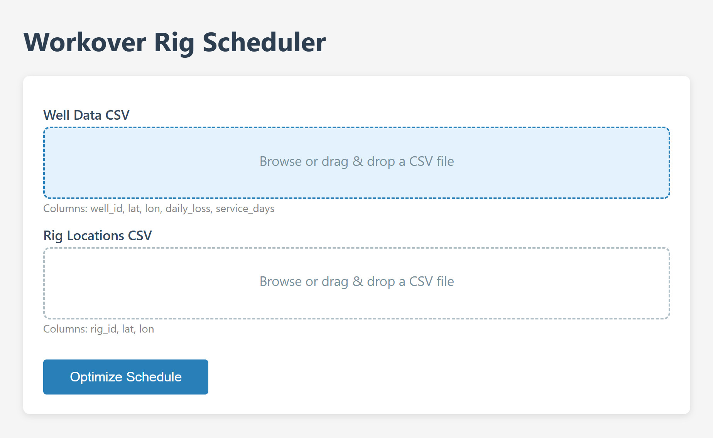
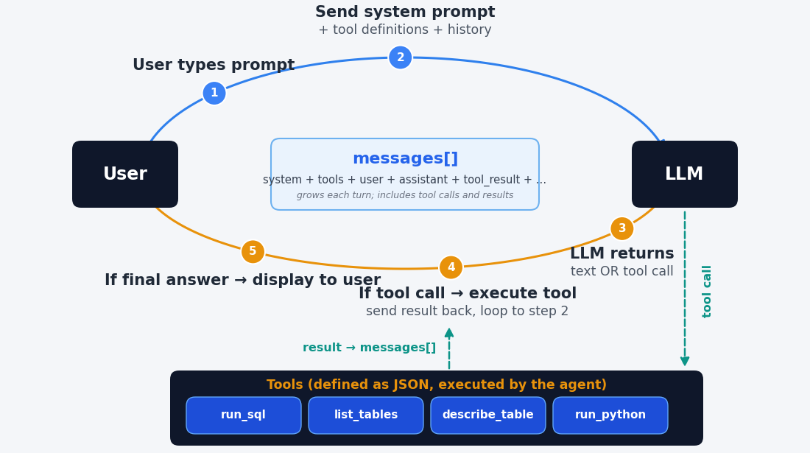
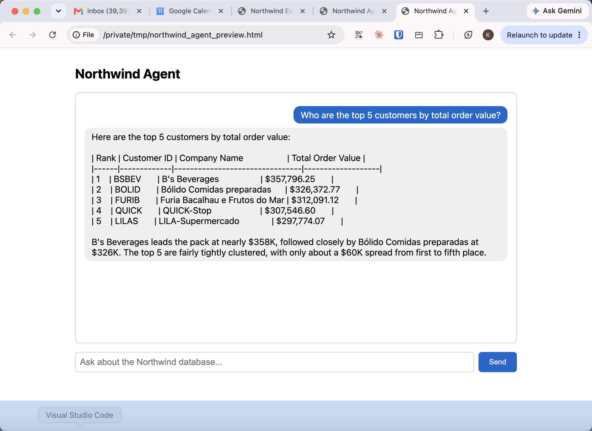

## From a Prompt to a Product

::: {.three-cards}
::: {.card .card-blue}
[An artifact]{.card-title}

A self-contained interactive page Claude builds inside the conversation --- a dashboard or calculator you use immediately
:::
::: {.card .card-amber}
[An app]{.card-title}

A web page with a form and a backend that does real work --- upload data, get a schedule, a chart, a report
:::
::: {.card .card-teal}
[An agent]{.card-title}

An app whose menus are replaced by plain language and a model that decides which tools to use
:::
:::

::: {.explainer}
Students describe what they want; Claude writes the code, runs it, and can put it online. To assign or grade any of this, it helps to know what a piece of software actually is.
:::

## How Software Works {.section-divider}

## Frontends and Backends

::: {.three-cards}
::: {.card .card-blue}
[Runs in a browser]{.card-title}

- You open a URL
- The browser runs the [frontend]{.accent} --- HTML, CSS, JavaScript
- Clicks send a request to the [backend]{.accent}, which does the work and replies
:::
::: {.card .card-amber}
[Looks native, but isn't]{.card-title}

- Slack, Spotify, Discord
- Each ships a stripped-down browser inside the app
- Same frontend/backend split underneath
:::
::: {.card .card-teal}
[See it yourself]{.card-title}

- Right-click any page → "View Page Source"
- That HTML, CSS, and JavaScript is the frontend
- Served by the backend the browser connected to
:::
:::

## Running It Locally

::: {.two-cards}
::: {.card .card-blue}
[127.0.0.1 --- "localhost"]{.card-title}

- The loopback address: traffic never leaves your machine
- Browser and server both on your own computer
- Where every app starts life before it goes online
:::
::: {.card .card-amber}
[Ports]{.card-title}

- A number saying which program should receive a request
- A local server often listens on 8000 → visit 127.0.0.1:8000
- Several servers can run at once, each on its own port
:::
:::

::: {.explainer}
When you deploy to the cloud, 127.0.0.1 becomes a real domain name --- the app code stays the same.
:::

## A Very Small App

```
from fastapi import FastAPI
from fastapi.responses import HTMLResponse

app = FastAPI()

@app.get("/")
def home():
    return HTMLResponse("<h1>Hello, world!</h1>")
```

::: {.explainer}
Serve it (Claude can do this for you), open 127.0.0.1:8000, and the browser sends "GET /", the server returns the HTML, and you see "Hello, world!" That is the whole shape of a web app --- everything else is more of the same.
:::

## Artifacts {.section-divider}

## The Fastest Path to a Working Thing

::: {.two-cards}
::: {.card .card-blue}
[What you get]{.card-title}

- An interactive page --- dashboard, calculator, visualization --- built right in the chat
- Use it instantly; ask for changes in the same conversation
- Publish a link, or download it as a single HTML file
:::
::: {.card .card-amber}
[When to use it]{.card-title}

- The shortest distance from idea to a shareable tool
- No terminal, no server to run
- Great for a one-off tool, a demo, or a student's first build
:::
:::

::: {.explainer}
No backend, no deployment --- everything runs in the browser. Perfect for a self-contained computation that doesn't need a database.
:::

## Standalone Apps in the Browser

{width=58% fig-align="center"}

::: {.explainer}
Python runs inside the browser through WebAssembly (Pyodide). The entire app --- form, logic, and charts --- lives in one HTML file. No server, no install, nothing for the user to set up.
:::

## A Real One Students Build

{width=54% fig-align="center"}

::: {.explainer}
Upload data, click a button, get back a schedule, a route map, and a chart. The backend runs verified Python; the frontend is a simple upload form and a results page. This is a graded deliverable that either works or it doesn't.
:::

## Agents {.section-divider}

## A Chatbot That Can Act

::: {.two-cards}
::: {.card .card-blue}
[Chatbot]{.card-title}

- User ↔ chatbot ↔ model
- Each turn sends the user's prompt, a system prompt, and the history
- It produces text --- nothing more
:::
::: {.card .card-amber}
[Agent]{.card-title}

- The same loop, plus [tools]{.accent}
- The model can run code, query a database, call an API
- It decides which tool to use, reads the result, and continues
:::
:::

{width=62% fig-align="center"}

## What Makes It an Agent

::: {.info-box}
::: {.box-title}
The designer holds every dial
:::

1. The [system prompt]{.accent} --- the agent's role, rules, and refusals
2. The [tools]{.accent} it is given --- and, just as important, the ones it is *not*
3. The [permission mode]{.accent} --- what it may do without asking
4. Limits --- how many steps, which actions need a human's yes
:::

::: {.explainer}
An agent is not a different technology. It is a model, a system prompt, and a carefully chosen set of tools --- the anatomy from session one, assembled into something that works on its own.
:::

## Example: A Database Agent

{width=70% fig-align="center"}

::: {.explainer}
Ask a business question in plain English; the agent writes SQL, runs it against the database, and answers. The guardrail is built in --- it is allowed to *read* the database but never to change it. Students build this against real data.
:::

## Building It: The Agent SDK

::: {.two-cards}
::: {.card .card-blue}
[The pieces]{.card-title}

- An API key from the Anthropic console, kept in a `.env` file
- The Agent SDK: a few lines to give the model tools and run the loop
- Your tools are just Python functions the model may call
:::
::: {.card .card-amber}
[The safety dials]{.card-title}

- Allowed tools and disallowed tools --- an explicit list
- Permission modes --- from "ask me every time" to "run freely"
- Start restrictive; loosen only what you trust
:::
:::

::: {.explainer}
The first and best guardrail is a tool the agent simply does not have. If it cannot send email or delete files, no clever prompt can make it.
:::

## Going Live {.section-divider}

## Two Paths to a Public URL

::: {.two-cards}
::: {.card .card-blue}
[GitHub Pages --- static & Pyodide]{.card-title}

- Name the page `index.html`, push, turn on Pages
- Live at a `github.io` address, free, no server
- Good for artifacts and browser-only apps
:::
::: {.card .card-amber}
[A PaaS --- apps & agents]{.card-title}

- Koyeb, Railway, Render go from a GitHub repo to a running service
- They handle the packaging; you skip the server plumbing
- The path for anything with a backend
:::
:::

::: {.explainer}
After you create the account, Claude Code can do the rest --- build, configure, and deploy. From a laptop to a public link is a short trip.
:::

## Why This Belongs in Your Course {.centered-statement}

::: {.card .card-dark}
A student who builds an artifact, an app, or an agent has to [decide what it should do]{.accent} and [judge whether it works.]{.accent} The building is now easy; the design and the verification are the learning --- and the deliverable either runs or it doesn't.
:::

## Breakout {.section-divider}

## Questions to Discuss

- What tool do you wish existed for your field that a student could build in a week?
- Would it be an artifact, an app, or an agent --- and why?
- If students built an agent on real data, what tools would you *withhold* from it?
- What would you look at to grade it --- the finished tool, the code, or how they defend its design?
