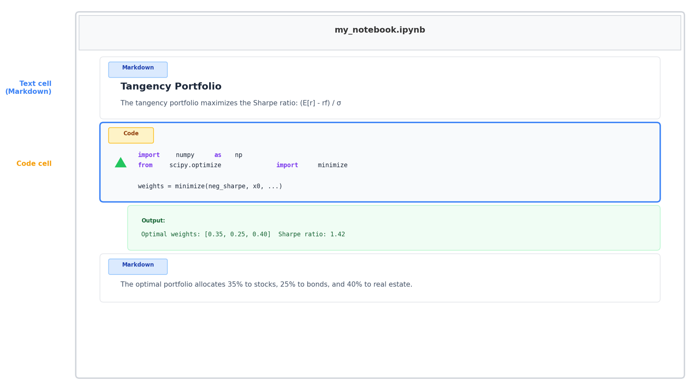

## The Setup Tax

::: {.two-cards}
::: {.card .card-red}
[The old way]{.card-title}

- Install the language, then the packages, then the editor
- Fight PATH variables, versions, and dependency errors
- Hours lost before a single line of research gets done
:::
::: {.card .card-teal}
[The new way]{.card-title}

- Open Claude Code and say what you want to work in
- It installs the software, wires it up, and fixes what breaks
- You describe the environment; it builds it
:::
:::

::: {.explainer}
This session is the research and teaching stack --- Python, R, Stata, LaTeX, Quarto, Git, GitHub --- and the single idea that Claude Code can stand all of it up for you.
:::

## VS Code: The Hub {.section-divider}

## One Editor for Everything

::: {.two-cards}
::: {.card .card-blue}
[What it is]{.card-title}

- A free editor that handles every language you use
- Python, R, Stata, LaTeX, Markdown, Quarto --- all in one window
- Extensions add support for each; Claude installs the ones you need
:::
::: {.card .card-amber}
[Why it is the hub]{.card-title}

- Claude lives in a side panel, aware of your open files
- Run code, edit papers, preview slides, commit to Git --- without leaving
- Proposed edits appear as a [diff]{.accent} you approve
:::
:::

::: {.explainer}
Pick one home for your work. VS Code plus Claude is that home --- everything below plugs into it.
:::

## Notebooks, Right in the Editor

{width=80% fig-align="center"}

::: {.explainer}
A Jupyter notebook interleaves code, output, and prose --- ideal for analysis you want to narrate. VS Code runs them natively, and Claude can build, run, and explain each cell.
:::

## Languages {.section-divider}

## Python and R

::: {.two-cards}
::: {.card .card-blue}
[Python]{.card-title}

- The default for data work, machine learning, and apps
- Claude installs libraries for you --- [pip install pandas]{.shell-cmd}
- On a Mac the command is [python3]{.shell-cmd}; Claude adjusts automatically
:::
::: {.card .card-amber}
[R]{.card-title}

- The statistician's language --- and much of empirical social science
- Claude writes and runs `.R` scripts, and knows the tidyverse and common packages
- Same loop: describe the analysis, it writes the code and runs it
:::
:::

::: {.explainer}
You do not have to choose a language on ideological grounds. Claude is fluent in both --- work in what your field and your co-authors use.
:::

## Stata

::: {.two-cards}
::: {.card .card-blue}
[Claude writes your do-files]{.card-title}

- Describe the regression, the panel setup, the table --- Claude writes the `.do` file
- It knows Stata syntax, `esttab`, `reghdfe`, and the usual toolkit
- Run it interactively, or let Claude run it in batch and read the log
:::
::: {.card .card-amber}
[The workflow]{.card-title}

- Keep your data and do-files in a project folder
- "Add clustered standard errors and re-run" --- it edits the do-file and executes
- The log becomes something Claude reads back and explains
:::
:::

::: {.explainer}
Stata's GUI is not the point of contact. The `.do` file is --- and that is exactly the kind of text Claude writes, edits, and reruns well.
:::

## Writing {.section-divider}

## LaTeX

::: {.two-cards}
::: {.card .card-blue}
[For papers that look right]{.card-title}

- The standard for math-heavy papers, journals, and job-market work
- Claude drafts sections, builds tables, and fixes the errors LaTeX is famous for
- It reads the cryptic compile errors and resolves them --- the worst part, gone
:::
::: {.card .card-amber}
[Tables from results]{.card-title}

- Point it at your regression output; it produces the formatted LaTeX table
- Change a spec, regenerate the table --- no hand-editing columns
- Figures, citations, and BibTeX handled the same way
:::
:::

::: {.explainer}
The tedium of LaTeX --- the debugging, the table formatting, the reference wrangling --- is precisely what AI removes.
:::

## Quarto: One Source, Many Outputs

::: {.three-cards}
::: {.card .card-dark}
[Write once]{.card-title}

Plain-text `.qmd` files: prose, code, and math together
:::
::: {.card .card-light}
[Render anywhere]{.card-title}

The same source becomes a paper (PDF), a website, or slides
:::
::: {.card .card-dark}
[These slides]{.card-title}

This deck is Quarto --- rendered to reveal.js, exportable to PDF or PowerPoint
:::
:::

::: {.explainer}
Quarto is the modern successor to R Markdown and works with Python, R, and Stata alike. Because it is plain text, Claude authors and restyles whole documents --- as it did for every deck in this course.
:::

## Git & GitHub {.section-divider}

## Git: Track Changes for a Whole Project

::: {.two-cards}
::: {.card .card-blue}
[The idea]{.card-title}

- Git is [Track Changes]{.accent} for an entire folder of files
- Every save you choose is a [commit]{.accent} --- a snapshot you can return to
- Break something? Roll back to any past version
:::
::: {.card .card-amber}
[With Claude, it is invisible]{.card-title}

- Claude Code installs Git and commits for you
- "Commit this," "show me what changed," "go back to yesterday's version"
- The safety net that lets you say yes to bigger changes
:::
:::

::: {.explainer}
The reason you can let AI edit your project freely is that Git remembers every state --- nothing is ever truly lost.
:::

## GitHub: Backup, Sharing, Publishing

::: {.two-cards}
::: {.card .card-blue}
[Your code in the cloud]{.card-title}

- GitHub hosts your Git projects --- backed up and shareable
- "Push this project to a new GitHub repo" --- Claude sets up the CLI and does it
- Co-authors clone it; you track issues and versions together
:::
::: {.card .card-amber}
[GitHub Pages: free hosting]{.card-title}

- Name a page `index.html`, push, flip on Pages
- Live at a `github.io` address --- no server, no cost
- Perfect for a course site, a paper's companion page, or a small app
:::
:::

::: {.explainer}
For solo research, GitHub is mainly backup plus a launch pad. For teaching, it is free hosting for anything you want students to reach.
:::

## The One-Line Setup

::: {.code-box}
::: {.box-title}
What you tell Claude Code
:::
Set up a research project in this folder. Install Python with pandas, numpy, statsmodels, and matplotlib; set up R; install Quarto and LaTeX. Create a project structure with folders for data, code, and output. Initialize Git and push it to a new private GitHub repo.
:::

::: {.explainer}
One paragraph. Claude installs each piece, verifies it, creates the structure, and hands you a working, version-controlled project --- the setup tax, paid once, by the machine.
:::

## The Point {.centered-statement}

::: {.card .card-dark}
The environment is no longer something you assemble by hand and pray works. You [describe the stack you want]{.accent} --- languages, writing tools, version control --- and Claude Code builds it, fixes it, and keeps it working. Your time goes to the research, not the setup.
:::

## Breakout {.section-divider}

## Questions to Discuss

- What is in your current research stack --- and what part of setting it up costs you the most time?
- Which language do you and your co-authors actually work in? Where would AI help across that boundary?
- Do you use version control now? What has "losing work" cost you that Git would have prevented?
- What would you want on a free GitHub Pages site for one of your courses?
