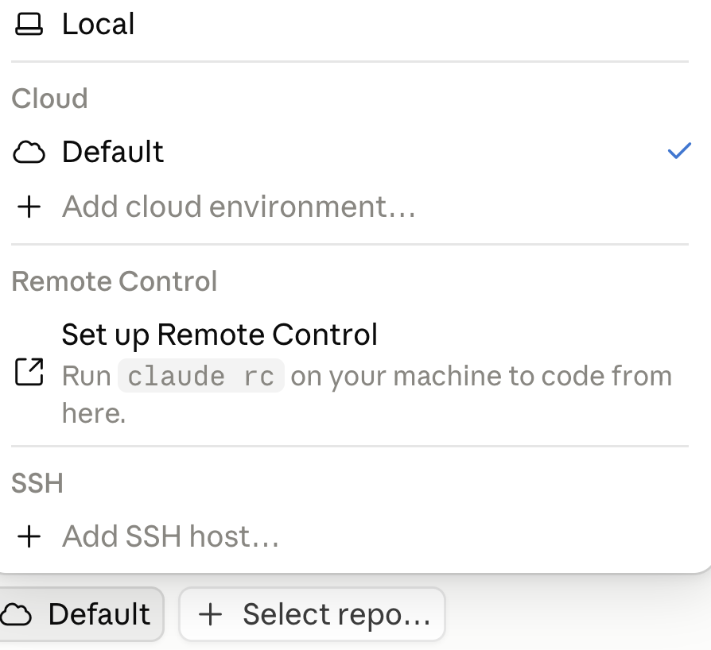
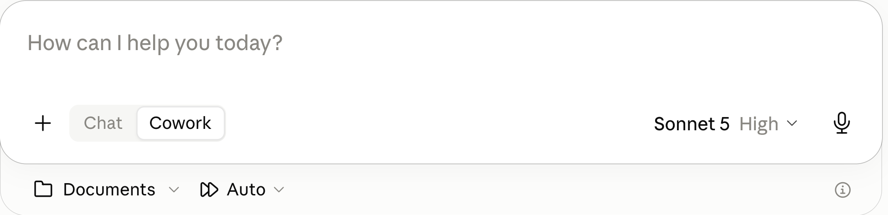
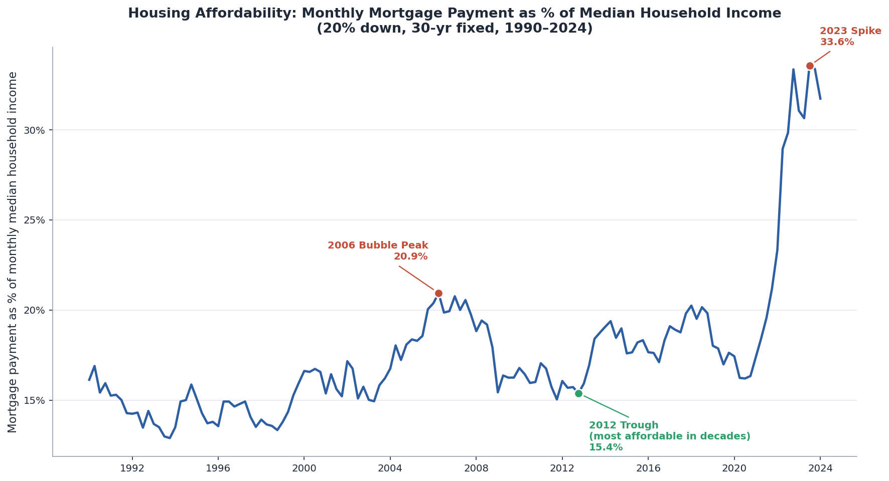

## Today's Session

::: {.step-flow-5}
::: {.step-card}
::: {.step-icon}
1
:::
::: {.step-title}
Overview
:::
:::
::: {.step-card}
::: {.step-icon}
2
:::
::: {.step-title}
Effective Prompting
:::
:::
::: {.step-card}
::: {.step-icon}
3
:::
::: {.step-title}
Code and Documents
:::
:::
::: {.step-card}
::: {.step-icon}
4
:::
::: {.step-title}
Verifying Things
:::
:::
::: {.step-card}
::: {.step-icon}
5
:::
::: {.step-title}
Practice
:::
:::
:::

## Overview {.section-divider}

## A Brief History

```{=html}
<style>
#a-brief-history .timeline { margin-top: 1.6em; }
/* run the axis dot-to-dot, not edge-to-edge, and centre it on the dots */
#a-brief-history .timeline::before {
  left: 10%; right: 10%; top: calc(0.8em + 11px); }
#a-brief-history .timeline-label { font-size: 0.62em; color: #2563eb; }
#a-brief-history .timeline-desc {
  font-size: 0.72em; font-weight: 600; color: #0f172a; margin-top: 0.35em; }
</style>

<div class="timeline">
  <div class="timeline-item">
    <div class="timeline-dot"></div>
    <div class="timeline-label">2022&ndash;2023</div>
    <div class="timeline-desc">Online chatbots</div>
  </div>
  <div class="timeline-item">
    <div class="timeline-dot"></div>
    <div class="timeline-label">2023&ndash;2024</div>
    <div class="timeline-desc">Code and web tools</div>
  </div>
  <div class="timeline-item">
    <div class="timeline-dot"></div>
    <div class="timeline-label">2025</div>
    <div class="timeline-desc">CLI tools</div>
  </div>
  <div class="timeline-item">
    <div class="timeline-dot"></div>
    <div class="timeline-label">2025&ndash;2026</div>
    <div class="timeline-desc">CLI in an app</div>
  </div>
  <div class="timeline-item">
    <div class="timeline-dot"></div>
    <div class="timeline-label">2026</div>
    <div class="timeline-desc">Cowork-type agents</div>
  </div>
</div>
```


## An Agent is a Chatbot with Tools

::: {.agent-architecture}
::: {.arch-box .arch-amber .arch-database style="background-color: #f0a500; color: #fff; padding: 0.5em 1em; border-radius: 8px;"}
Code Execution
:::
::: {.arch-arrow-v .arch-arrow-down}
&#8597;
:::
::: {.arch-box .arch-dark .arch-user}
User
:::
::: {.arch-arrow-h .arch-h1}
&#8596;
:::
::: {.arch-box .arch-accent .arch-agent}
Agent
:::
::: {.arch-arrow-h .arch-h2}
&#8596;
:::
::: {.arch-box .arch-dark .arch-llm}
LLM
:::
::: {.arch-arrow-v .arch-arrow-up}
&#8597;
:::
::: {.arch-box .arch-amber .arch-tools style="background-color: #f0a500; color: #fff; padding: 0.5em 1em; border-radius: 8px;"}
Other Tools
:::
:::

## Agent in More Detail

{width=75% fig-align="center"}


## Four Modes of Claude Desktop {.mode-cards}

::: {.card .card-blue}
::: {.mode-split}
::: {}
[Home or Code?]{.card-title}

The two halves of the app, chosen at the top of the left sidebar (the square icon toggles the sidebar)
:::
::: {}
{width=70% fig-align="center"}
:::
:::
:::

## Four Modes of Claude Desktop {.mode-cards}

::: {.two-cards}
::: {.card .card-amber}
::: {.mode-split}
::: {}
[Within Home, Chat or Cowork?]{.card-title}

Toggle in the prompt box
:::
::: {}
{width=95% fig-align="center"}
:::
:::
:::
::: {.card .card-teal}
::: {.mode-split}
::: {}
[Within Code, Local or Cloud?]{.card-title}

Selector at the bottom of the window
:::
::: {}
{width=88% fig-align="center"}
:::
:::
:::
:::

## What to Use?

::: {.four-cards}
::: {.card-blue}
- You can chat in any mode
- You can execute code in any mode
:::
::: {.card-amber}
Cowork > Chat on many dimensions.  Requires paid account.
:::
::: {.card-teal}
Code Local is best for most people, but Claude Desktop is not the best venue 
:::
::: {.card-purple}
[Use Cowork for now]{.accent} 

(more later)
:::
:::

::: {.explainer}
Code Cloud is GitHub integration, probably overkill
:::

## Configuration

- [Create New Project + Use a Folder]{.accent} Give Claude access to your local files.  Store project-specific instructions.
- [Auto]{.accent} Automatically approve.  Misleading name.  Claude decides: safe -> don't ask permission, possibly risky -> ask permission 
- [Model]{.accent} I recommend Sonnet 5.  Capable for anything you probably want to do.  Faster and cheaper (easier on token quota).

{width=90% fig-align="center"}


## Effective Prompting {.section-divider}

## Plan Mode

Claude Desktop has an explicit Plan mode. Or add "plan how to do this before you start."

::: {.two-cards}
::: {.card-blue}
[Why It Works: Knowledge]{.card-title}

- Planning pulls relevant knowledge into the context window
- The model answers in light of what it just retrieved, not base rates
:::
::: {.card-amber}
[Why It Works: Scale]{.card-title}

- Decompose the work into subtasks
- Verify each one before the next
- Failures stay small and local
:::
:::

## AI is a Prediction Machine, not a Rational Person

Suppose Claude has told you in the past that Method A beats Method B for some task. You ask it to do the task.

::: {.two-cards}
::: {.card .card-blue}
[Do not assume it will use what it knows.]{.accent} If "A beats B" is not in the context window, and B appeared more often in its training data, it will probably use B.
:::
::: {.card .card-amber}
This is the value of "plan before you act."  Planning surfaces "A beats B," leading Claude to select A for the task.
:::
:::

## Steelmanning

Don't ask AI whether your idea is good. Ask it to make the strongest possible case that your idea is [wrong]{.accent}.

::: {.info-box}

**Sycophancy:** training on human feedback teaches that agreement gets high ratings. Ask "is my plan sound?" and Claude finds reasons it is.

**The fix:** "What is the strongest argument against this acquisition?"

**One step further:** have it play a skeptical board member, a regulator, a competitor.
:::


## Numbers Need Code

Never trust AI arithmetic. Have it write and run code.

::: {.two-cards}
::: {.card .card-blue}
[The Problem]{.card-title}

- "47.3%" is as plausible as "52.1%" to a next-token predictor
- Mental math, rankings, comparisons, aggregations --- all unreliable
- Wrong numbers stated with complete confidence
:::
::: {.card .card-amber .fragment}
[The Fix]{.card-title}

- Ask for Python, and have it run
- Arithmetic becomes computation, not prediction
- Code execution is built into every chatbot and Claude Code
:::
:::


## What Not to Do

2022--2023 conventions are now useless or counterproductive.

::: {.two-cards}
::: {.card .card-blue .fragment}
[Skip These]{.card-title}

- "Think step by step" --- reasoning models already do, in hidden tokens
- "Take a deep breath" --- measurably useless now
- "CRITICAL! NEVER EVER..." --- overtriggers, and gets worse results
:::
::: {.card .card-amber .fragment}
[Use With Care]{.card-title}

- "You are an expert data analyst ..."
- Persona stacking can improve tone and structure
- Direct task framing usually wins
:::
:::


## Code and Documents {.section-divider}

## Example Prompt

::: {.prompt-box}
Download three FRED (Federal Reserve Economic Data) series as CSV: mortgage rate (MORTGAGE30US), home price (MSPUS), household income (MEHOINUSA672N), 1990 through most recent.

1. MORTGAGE30US is weekly --- resample to quarterly by averaging. MSPUS is already quarterly. MEHOINUSA672N is annual --- interpolate linearly between annual observations to produce quarterly values.

2. Assume a 20% down payment and a 30-year loan. Compute the monthly mortgage payment on a median-priced home and express it as a percentage of monthly median household income.

3. Plot the affordability ratio as a line chart. Annotate three points: the 2006 bubble peak, the 2012 trough (most affordable in decades, as low rates met depressed prices), and the 2023 spike.
:::

## Result 




## Reading, Editing, and Writing Documents

Claude natively reads [text and images]{.accent}, and natively writes [text]{.accent}. Everything beyond text is handled by code.

- Document reading is doc -> text, then read
- Document creation is text (code) -> doc
- Office document editing is 'read and write XML (Extensible Markup Language)'

## Example

::: {.prompt-box}
Get Tesla's EPS from SEC EDGAR by quarter for the past 5 years.  Plot.  Create a PowerPoint deck with the plot plus discussion.
:::

::: {.response-box}
::: {.box-title}
The result
:::

[tesla.pptx](../files/session1/tesla.pptx)
:::

## Creating Excel Workbooks

Claude uses Python to create Excel workbooks, inserting numbers (inputs) and formulas cell-by-cell 

::: {.prompt-box}
::: {.box-title}
Example Prompt
:::
Build an Excel workbook containing a mortgage amortization table. Include a chart of the amount going to interest and the amount going to principal each month.
:::

::: {.response-box}
::: {.box-title}
Result
:::
[amortization.xlsx](../amortization.xlsx)
:::


## Claude Plugin for Excel

A chat panel inside Excel itself. Add it from `Home → Add-ins`.  You will be prompted to connect to your Anthropic account (paid account).


::: {.info-box}
::: {.box-title}
Example
:::

{width=85% fig-align="center"}
:::

## Verifying Things {.section-divider}

## Verify Claims

::: {.two-cards}
::: {.card .card-teal}
[The Problem]{.card-title}

- Facts, regulations, dates, citations --- stated the same way whether real or invented
- The more obscure the fact, the likelier it is fabricated

:::
::: {.card .card-purple}
[The Fix]{.card-title}

- Have it search before answering
- Ask for sources. Then check them.

:::
:::

## Verify Code

Consider a human assistant.  Ask where they could have gone wrong.

::: {.highlight-box}
- They may not have understood what you wanted.
- To perform the task, they may have had to make decisions that were different from the decisions you would have made.
- Their Excel, code, or whatever may have had subtle bugs so it did not do what they expected.
:::

Claude can go wrong in exactly the same ways.  How do you check them?

## Three Checks

Take advantage of the fact that **AI is perfectly patient**.  You can probe more deeply than you would with a human assistant, and it will not be offended.

::: {.step-flow-3}
::: {.step-card .fragment}
::: {.step-title}
Check its understanding
:::
::: {.step-desc}
*Explain to me what you did and how you did it.*
:::
:::
::: {.step-card .fragment}
::: {.step-title}
Check its decisions
:::
::: {.step-desc}
*Report all ways in which my instructions were ambiguous and you made decisions  we have not discussed.*
:::
:::
::: {.step-card .fragment}
::: {.step-title}
Check its code
:::
::: {.step-desc}
*Show me a sample case and work through the case as if by hand so I can verify your number.*
:::
:::
:::


## Generator-Critic

Spawn a second Claude to attack the first one's output, not validate it. Subagents work well --- several of them.

::: {.two-cards}
::: {.card .card-light .fragment}
[The Pattern]{.card-title}

- [Generator]{.accent} produces the work
- [Critic]{.accent} gets: "Find every factual error, logical gap, and unsupported assumption. Do not summarize --- find flaws."
:::
::: {.card .card-dark .fragment}
[Why a Separate Instance?]{.card-title}

- A model is anchored to its own output and defends it
- A fresh instance with an adversarial mandate is not
:::
:::


## Re-Use Tested Code

Once code runs correctly, save it. Re-use it rather than rewrite it.

::: {.info-box}
::: {.box-title}
The Problem with Rewriting
:::

- Different choices each time
- Scripts that should agree may not
- Old bugs reappear
:::

## Practice {.section-divider}

## Some Local Data

Extract the following from session1.zip into your project folder or just put session1.zip there and tell Claude to extract.

::: {.comparison-table}

| File | Rows | Key Columns |
|---|---|---|
| [northwind_customers.xlsx](../files/session1/northwind_customers.xlsx) | 93 | CustomerID, CompanyName, Country |
| [northwind_orders.xlsx](../files/session1/northwind_orders.xlsx) | 500 | OrderID, CustomerID, OrderDate |
| [northwind_orderdetails.xlsx](../files/session1/northwind_orderdetails.xlsx) | 18,976 | OrderID, ProductID, UnitPrice, Quantity |
| [northwind_products.xlsx](../files/session1/northwind_products.xlsx) | 77 | ProductID, ProductName, CategoryID |
| [northwind_categories.xlsx](../files/session1/northwind_categories.xlsx) | 8 | CategoryID, CategoryName |

:::

## Example: Merge, Filter, Aggregate, Chart, Analyze, Save

::: {.code-box}
::: {.box-title}
Copy this prompt into Claude:
:::
I have five Northwind files in my project folder: customers, orders, order details, products, and categories. Which product categories generated the most revenue from customers in Germany and France? Show only categories above $10,000, sort highest to lowest, create a bar chart, and put it in a PowerPoint deck.  Add some discussion.
:::

::: {.explainer}
Here we put a lot into one prompt.  More commonly, we would ask it to take first steps, then do something else, then do something else, ...  Either works fine.
:::

## Homework {.centered-statement}

::: {.card .card-dark}
Watch the three-minute video [academic_studio.mp4](../files/session1/academic_studio.mp4)
:::


