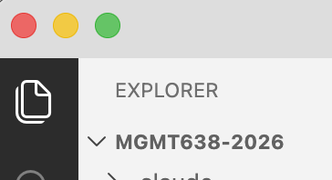
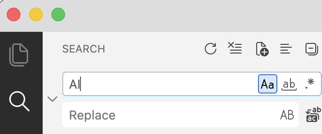
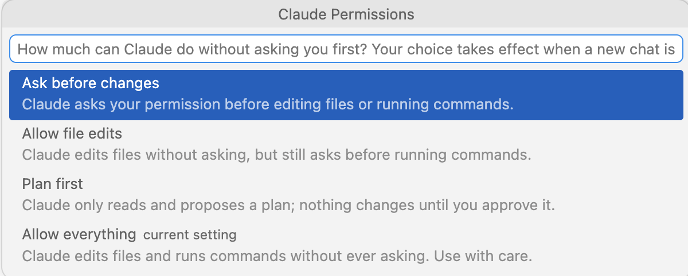

## Workshop Overview

```{=html}
<style>
/* Session schedule, copied from deck 1 and extended with a highlight for the
   session this deck belongs to: that row keeps full contrast and an amber
   block, the rest step back so the eye lands on today without having to read.
   Scoped to .session-grid rather than to the slide's id, so renaming the
   heading cannot detach the styling. */
.session-grid {
  display: grid;
  grid-template-columns: repeat(2, max-content);
  justify-content: center;
  column-gap: 4.5em;
  margin-top: 0.7em;
}
.session-grid .sg-col { display: flex; flex-direction: column; gap: 0.75em; }
.session-grid .sg-row { display: flex; align-items: center; gap: 1.1em; }
.session-grid .sg-when {
  flex: 0 0 7.6em;
  background: #00205B;
  border-radius: 6px;
  text-align: center;
  padding: 0.5em 0;
  line-height: 1.1;
}
.session-grid .sg-day {
  display: block; color: #fff;
  font-size: 0.62em; font-weight: 700; letter-spacing: 0.07em;
}
.session-grid .sg-time {
  display: block; color: #fff; opacity: 0.85;
  font-size: 0.51em; font-weight: 600; letter-spacing: 0.035em; margin-top: 0.12em;
}
.session-grid .sg-title { font-size: 0.8em; font-weight: 700; color: #00205B; }

/* Today. Everything that is not this row recedes; the row itself gains an
   amber block with navy type on it, which reads at the back of the room. */
.session-grid .sg-row:not(.is-now) { opacity: 0.42; }
.session-grid .sg-row.is-now .sg-when { background: #f59e0b; }
.session-grid .sg-row.is-now .sg-day,
.session-grid .sg-row.is-now .sg-time { color: #00205B; opacity: 1; }
.session-grid .sg-row.is-now .sg-title { color: #b45309; }
</style>

<div class="session-grid">
  <div class="sg-col">
    <div class="sg-row"><span class="sg-when"><span class="sg-day">AUG 10</span><span class="sg-time">3:00&ndash;4:00</span></span><span class="sg-title">Intro to Claude</span></div>
    <div class="sg-row is-now"><span class="sg-when"><span class="sg-day">AUG 11</span><span class="sg-time">3:00&ndash;4:00</span></span><span class="sg-title">Working with Claude</span></div>
    <div class="sg-row"><span class="sg-when"><span class="sg-day">AUG 12</span><span class="sg-time">3:00&ndash;4:00</span></span><span class="sg-title">Teaching Tools</span></div>
    <div class="sg-row"><span class="sg-when"><span class="sg-day">AUG 13</span><span class="sg-time">3:00&ndash;4:00</span></span><span class="sg-title">AI Tutors</span></div>
  </div>
  <div class="sg-col">
    <div class="sg-row"><span class="sg-when"><span class="sg-day">AUG 14</span><span class="sg-time">3:00&ndash;4:00</span></span><span class="sg-title">Student Projects</span></div>
    <div class="sg-row"><span class="sg-when"><span class="sg-day">AUG 17</span><span class="sg-time">3:00&ndash;4:00</span></span><span class="sg-title">AI for Research</span></div>
    <div class="sg-row"><span class="sg-when"><span class="sg-day">AUG 19</span><span class="sg-time">3:00&ndash;4:00</span></span><span class="sg-title">Personal Assistants</span></div>
    <div class="sg-row"><span class="sg-when"><span class="sg-day">AUG 19</span><span class="sg-time">4:00&ndash;5:00</span></span><span class="sg-title">Overflow/Extra</span></div>
  </div>
</div>
```

## Today's Session

::: {.step-flow-5}
::: {.step-card .fragment}
::: {.step-icon}
1
:::
::: {.step-title}
Academic Studio
:::
:::
::: {.step-card .fragment}
::: {.step-icon}
2
:::
::: {.step-title}
The Command Line
:::
:::
::: {.step-card .fragment}
::: {.step-icon}
3
:::
::: {.step-title}
CLAUDE.md and Skills
:::
:::
::: {.step-card .fragment}
::: {.step-icon}
4
:::
::: {.step-title}
Claude as an Assistant
:::
:::
::: {.step-card .fragment}
::: {.step-icon}
5
:::
::: {.step-title}
PowerPoint
:::
:::
:::

## Academic Studio {.section-divider}

## File Explorer and Search {.shrink}

Reach the File Explorer tool from the left toolbar.

::: {.two-cards}
::: {.card-blue}
[Files]{.card-title}

- Right-click to rename, copy, ...
- Double-click to open in Academic Studio viewer
- Viewer provides different options for different file types (cannot edit Office docs)

{width=40% fig-align="center"}
:::
::: {.card-amber}
[Search]{.card-title}

- The magnifying glass searches [inside every file]{.accent} in the folder at once
- Options for case, whole word, and regular expressions
- Replace across all files from the same pane

{width=60% fig-align="center"}
:::

:::


## Useful Features{.shrink}

::: {.three-cards}
::: {.card-blue}
[Claude icon on top right]{.card-title}

- Open a new conversation
- Can run multiple conversations simultaneously
:::
::: {.card-amber}
[Extensions in left toolbar]{.card-title}

- Many VS Codium extensions to choose from
- Some are pre-installed
:::


::: {.card-purple}
[Remote SSH in left toolbar]{.card-title}

- Connect to jgsrc1 or a different remote server
- Files and code execution on remote server.  Academic Studio runs on your computer.
:::
:::


## Permissions

{width=78% fig-align="center"}

## Some Claude Commands

::: {.comparison-table}

| Command | What it does |
|---|---|
| [/resume]{.accent} | a version of Claude/Conversations |
| [/model]{.accent} | select from Fable, Opus (default), Sonnet, and Haiku |
| [/clear]{.accent} | clear the context window (= new conversation) |
| [/compact]{.accent} | summarize the conversation in a text file, launch a new conversation that reads the text file |
| [Esc]{.accent} | escape key interrupts Claude, which then waits for new instructions |

:::

## File View and Edit

- Extract and double-click files in session2.zip/sample_files
- Need different extensions installed for different filetypes (use Run Setup)
- Office docs are read only

::: {.claude-bullets}
- .py is a Python script, .ipynb is a Jupyter notebook
- .tex builds with 'Play' button, .qmd builds with Preview button
- .html toggles between editable text (HTML code) and browser-view with globe button
- .md toggles between editable text (Markdown code) and rendered view with pencil button
:::

## Fit with VS Code 

- Independent apps, individual extensions and settings 
- They share Claude --- same CLAUDE.md, same skills, same conversation history 
- Example: Work on project in Academic Studio.  Then open in VS Code. [/resume]{.accent} brings up conversation history from Academic Studio.  

## The Command Line {.section-divider}

## Using a Terminal (Command Line)

- Windows: Command Prompt, Windows PowerShell, Windows Terminal
- Mac Terminal
- Open.  Then type commands.  Syntax must be right (not intelligent)

## What Claude Can Do at the Command Line

::: {.three-cards}
::: {.card .card-blue .fragment}
[File operations]{.card-title}

Move, copy, rename, delete, search within.

*Find all files in my Documents folder that discuss ... and move them to ...*
:::
::: {.card .card-amber .fragment}
[Install and run software]{.card-title}

*Run a python script, build a LaTeX doc, ...*
:::
::: {.card .card-teal .fragment}
[Interact with external services]{.card-title}

Command Line Interfaces (CLIs): `gh` for GitHub,  `aws` for Amazon Web Services, ...  Also, use APIs.
:::
:::

## More Things Claude Can Do at the Command Line

::: {.six-cards}
::: {.card-blue}
`pandoc` --- convert between Word, Markdown, HTML, PDF
:::
::: {.card-amber}
`ImageMagick` --- resize, crop, convert images in bulk
:::
::: {.card-teal}
`ffmpeg` --- trim video, transcode, pull the audio out
:::
::: {.card-purple}
`ripgrep` --- search thousands of files in seconds
:::
::: {.card-red}
`cron` --- run a command on a schedule
:::
:::


## Example: Git (Search the Past)

Git is a version control system.  A **commit** records the current state of a folder (repository=repo).  Git **is not** AI.  Git existed long before AI.  But AI knows Git.


::: {.code-box}
::: {.box-title}
Tell Claude
:::
Install Git.  Commit this folder to Git.
:::

Frequently, thereafter, tell Claude to commit changes.


##

At some point, you realize that you want to recover something from a version that was overwritten sometime in the past:

::: {.code-box}
::: {.box-title}
Tell Claude
:::
Find a prior version of ... that said ... Add that to the current version.
:::


## CLAUDE.md and Skills {.section-divider}


## CLAUDE.md

::: {.two-cards}
::: {.card .card-teal}
[Where Claude Looks]{.card-title}

- At the start of each conversation, Claude looks in specific places for CLAUDE.md files
- It looks in your home directory (C:\\users\\yourname on Windows) and it looks in the project folder
:::
::: {.card .card-purple}
[What It Is]{.card-title}

- A CLAUDE.md is a text file that contains instructions for Claude
- Claude reads the entire file, so use it sparingly
:::
:::

::: {.explainer}
You could get the same behavior by pasting the instructions in the prompt window
:::


## Skills

::: {.three-cards}
::: {.card .card-teal}
[At Startup]{.card-title}

At the start of each conversation, Claude also looks in specific places for SKILL.md files
:::
::: {.card .card-purple}
[Two Locations]{.card-title}

It looks in your home directory (C:\\users\\yourname on Windows) and it looks in the project folder
:::
::: {.card .card-dark}
[Loaded on Demand]{.card-title}

Skills are text files saved on your hard drive.  Claude reads the top of each SKILL.md file on startup, and it reads the bulk of the file [only when needed]{.accent}
:::
:::


## Installing Skills

::: {.two-cards}
::: {.card .card-teal}
[Where to Find Them]{.card-title}

- There are thousands of skills published on the internet.
- Anthropic publishes skills (xlsx, etc.) at [https://github.com/anthropics/skills/](https://github.com/anthropics/skills/){target="_blank"}
:::
::: {.card .card-purple}
[Ask Claude]{.card-title}

- To search for skills, ask Claude.  To install a skill you want, ask Claude.
- Other than a few of Anthropic's skills, the most useful skills are generally those you create, because they are customized to your work.
:::
:::

## Example: xlsx Skill

The xlsx, docx, and pptx skills are created by Anthropic and come pre-installed with Claude Desktop

```{=html}
<div class="prompt-scroll" style="height:620px;overflow-y:auto;background:#1e1e2e;color:#cdd6f4;padding:1.2em;border-radius:8px;font-family:'Fira Code','Consolas',monospace;font-size:0.52em;line-height:1.5;"><pre id="xlsx-skill-text" style="white-space:pre-wrap;word-break:break-word;"></pre></div>
<script>document.getElementById("xlsx-skill-text").textContent="---\nname: xlsx\ndescription: \"Use this skill any time a spreadsheet file is the primary input or output. This means any task where the user wants to: open, read, edit, or fix an existing .xlsx, .xlsm, .csv, or .tsv file (e.g., adding columns, computing formulas, formatting, charting, cleaning messy data); create a new spreadsheet from scratch or from other data sources; or convert between tabular file formats. Trigger especially when the user references a spreadsheet file by name or path — even casually (like \\\"the xlsx in my downloads\\\") — and wants something done to it or produced from it. Also trigger for cleaning or restructuring messy tabular data files (malformed rows, misplaced headers, junk data) into proper spreadsheets. The deliverable must be a spreadsheet file. Do NOT trigger when the primary deliverable is a Word document, HTML report, standalone Python script, database pipeline, or Google Sheets API integration, even if tabular data is involved.\"\nlicense: Proprietary. LICENSE.txt has complete terms\n---\n\n# Requirements for Outputs\n\n## All Excel files\n\n### Professional Font\n- Use a consistent, professional font (e.g., Arial, Times New Roman) for all deliverables unless otherwise instructed by the user\n\n### Zero Formula Errors\n- Every Excel model MUST be delivered with ZERO formula errors (#REF!, #DIV/0!, #VALUE!, #N/A, #NAME?)\n\n### Preserve Existing Templates (when updating templates)\n- Study and EXACTLY match existing format, style, and conventions when modifying files\n- Never impose standardized formatting on files with established patterns\n- Existing template conventions ALWAYS override these guidelines\n\n## Financial models\n\n### Color Coding Standards\nUnless otherwise stated by the user or existing template\n\n#### Industry-Standard Color Conventions\n- **Blue text (RGB: 0,0,255)**: Hardcoded inputs, and numbers users will change for scenarios\n- **Black text (RGB: 0,0,0)**: ALL formulas and calculations\n- **Green text (RGB: 0,128,0)**: Links pulling from other worksheets within same workbook\n- **Red text (RGB: 255,0,0)**: External links to other files\n- **Yellow background (RGB: 255,255,0)**: Key assumptions needing attention or cells that need to be updated\n\n### Number Formatting Standards\n\n#### Required Format Rules\n- **Years**: Format as text strings (e.g., \"2024\" not \"2,024\")\n- **Currency**: Use $#,##0 format; ALWAYS specify units in headers (\"Revenue ($mm)\")\n- **Zeros**: Use number formatting to make all zeros \"-\", including percentages (e.g., \"$#,##0;($#,##0);-\")\n- **Percentages**: Default to 0.0% format (one decimal)\n- **Multiples**: Format as 0.0x for valuation multiples (EV/EBITDA, P/E)\n- **Negative numbers**: Use parentheses (123) not minus -123\n\n### Formula Construction Rules\n\n#### Assumptions Placement\n- Place ALL assumptions (growth rates, margins, multiples, etc.) in separate assumption cells\n- Use cell references instead of hardcoded values in formulas\n- Example: Use =B5*(1+$B$6) instead of =B5*1.05\n\n#### Formula Error Prevention\n- Verify all cell references are correct\n- Check for off-by-one errors in ranges\n- Ensure consistent formulas across all projection periods\n- Test with edge cases (zero values, negative numbers)\n- Verify no unintended circular references\n\n#### Documentation Requirements for Hardcodes\n- Comment or in cells beside (if end of table). Format: \"Source: [System/Document], [Date], [Specific Reference], [URL if applicable]\"\n- Examples:\n  - \"Source: Company 10-K, FY2024, Page 45, Revenue Note, [SEC EDGAR URL]\"\n  - \"Source: Company 10-Q, Q2 2025, Exhibit 99.1, [SEC EDGAR URL]\"\n  - \"Source: Bloomberg Terminal, 8/15/2025, AAPL US Equity\"\n  - \"Source: FactSet, 8/20/2025, Consensus Estimates Screen\"\n\n# XLSX creation, editing, and analysis\n\n## Overview\n\nA user may ask you to create, edit, or analyze the contents of an .xlsx file. You have different tools and workflows available for different tasks.\n\n## Important Requirements\n\n**LibreOffice Required for Formula Recalculation**: You can assume LibreOffice is installed for recalculating formula values using the `scripts/recalc.py` script. The script automatically configures LibreOffice on first run, including in sandboxed environments where Unix sockets are restricted (handled by `scripts/office/soffice.py`)\n\n## Reading and analyzing data\n\n### Data analysis with pandas\nFor data analysis, visualization, and basic operations, use **pandas** which provides powerful data manipulation capabilities:\n\n```python\nimport pandas as pd\n\n# Read Excel\ndf = pd.read_excel('file.xlsx')  # Default: first sheet\nall_sheets = pd.read_excel('file.xlsx', sheet_name=None)  # All sheets as dict\n\n# Analyze\ndf.head()      # Preview data\ndf.info()      # Column info\ndf.describe()  # Statistics\n\n# Write Excel\ndf.to_excel('output.xlsx', index=False)\n```\n\n## Excel File Workflows\n\n## CRITICAL: Use Formulas, Not Hardcoded Values\n\n**Always use Excel formulas instead of calculating values in Python and hardcoding them.** This ensures the spreadsheet remains dynamic and updateable.\n\n### ❌ WRONG - Hardcoding Calculated Values\n```python\n# Bad: Calculating in Python and hardcoding result\ntotal = df['Sales'].sum()\nsheet['B10'] = total  # Hardcodes 5000\n\n# Bad: Computing growth rate in Python\ngrowth = (df.iloc[-1]['Revenue'] - df.iloc[0]['Revenue']) / df.iloc[0]['Revenue']\nsheet['C5'] = growth  # Hardcodes 0.15\n\n# Bad: Python calculation for average\navg = sum(values) / len(values)\nsheet['D20'] = avg  # Hardcodes 42.5\n```\n\n### ✅ CORRECT - Using Excel Formulas\n```python\n# Good: Let Excel calculate the sum\nsheet['B10'] = '=SUM(B2:B9)'\n\n# Good: Growth rate as Excel formula\nsheet['C5'] = '=(C4-C2)/C2'\n\n# Good: Average using Excel function\nsheet['D20'] = '=AVERAGE(D2:D19)'\n```\n\nThis applies to ALL calculations - totals, percentages, ratios, differences, etc. The spreadsheet should be able to recalculate when source data changes.\n\n## Common Workflow\n1. **Choose tool**: pandas for data, openpyxl for formulas/formatting\n2. **Create/Load**: Create new workbook or load existing file\n3. **Modify**: Add/edit data, formulas, and formatting\n4. **Save**: Write to file\n5. **Recalculate formulas (MANDATORY IF USING FORMULAS)**: Use the scripts/recalc.py script\n   ```bash\n   python scripts/recalc.py output.xlsx\n   ```\n6. **Verify and fix any errors**: \n   - The script returns JSON with error details\n   - If `status` is `errors_found`, check `error_summary` for specific error types and locations\n   - Fix the identified errors and recalculate again\n   - Common errors to fix:\n     - `#REF!`: Invalid cell references\n     - `#DIV/0!`: Division by zero\n     - `#VALUE!`: Wrong data type in formula\n     - `#NAME?`: Unrecognized formula name\n\n### Creating new Excel files\n\n```python\n# Using openpyxl for formulas and formatting\nfrom openpyxl import Workbook\nfrom openpyxl.styles import Font, PatternFill, Alignment\n\nwb = Workbook()\nsheet = wb.active\n\n# Add data\nsheet['A1'] = 'Hello'\nsheet['B1'] = 'World'\nsheet.append(['Row', 'of', 'data'])\n\n# Add formula\nsheet['B2'] = '=SUM(A1:A10)'\n\n# Formatting\nsheet['A1'].font = Font(bold=True, color='FF0000')\nsheet['A1'].fill = PatternFill('solid', start_color='FFFF00')\nsheet['A1'].alignment = Alignment(horizontal='center')\n\n# Column width\nsheet.column_dimensions['A'].width = 20\n\nwb.save('output.xlsx')\n```\n\n### Editing existing Excel files\n\n```python\n# Using openpyxl to preserve formulas and formatting\nfrom openpyxl import load_workbook\n\n# Load existing file\nwb = load_workbook('existing.xlsx')\nsheet = wb.active  # or wb['SheetName'] for specific sheet\n\n# Working with multiple sheets\nfor sheet_name in wb.sheetnames:\n    sheet = wb[sheet_name]\n    print(f\"Sheet: {sheet_name}\")\n\n# Modify cells\nsheet['A1'] = 'New Value'\nsheet.insert_rows(2)  # Insert row at position 2\nsheet.delete_cols(3)  # Delete column 3\n\n# Add new sheet\nnew_sheet = wb.create_sheet('NewSheet')\nnew_sheet['A1'] = 'Data'\n\nwb.save('modified.xlsx')\n```\n\n## Recalculating formulas\n\nExcel files created or modified by openpyxl contain formulas as strings but not calculated values. Use the provided `scripts/recalc.py` script to recalculate formulas:\n\n```bash\npython scripts/recalc.py <excel_file> [timeout_seconds]\n```\n\nExample:\n```bash\npython scripts/recalc.py output.xlsx 30\n```\n\nThe script:\n- Automatically sets up LibreOffice macro on first run\n- Recalculates all formulas in all sheets\n- Scans ALL cells for Excel errors (#REF!, #DIV/0!, etc.)\n- Returns JSON with detailed error locations and counts\n- Works on both Linux and macOS\n\n## Formula Verification Checklist\n\nQuick checks to ensure formulas work correctly:\n\n### Essential Verification\n- [ ] **Test 2-3 sample references**: Verify they pull correct values before building full model\n- [ ] **Column mapping**: Confirm Excel columns match (e.g., column 64 = BL, not BK)\n- [ ] **Row offset**: Remember Excel rows are 1-indexed (DataFrame row 5 = Excel row 6)\n\n### Common Pitfalls\n- [ ] **NaN handling**: Check for null values with `pd.notna()`\n- [ ] **Far-right columns**: FY data often in columns 50+ \n- [ ] **Multiple matches**: Search all occurrences, not just first\n- [ ] **Division by zero**: Check denominators before using `/` in formulas (#DIV/0!)\n- [ ] **Wrong references**: Verify all cell references point to intended cells (#REF!)\n- [ ] **Cross-sheet references**: Use correct format (Sheet1!A1) for linking sheets\n\n### Formula Testing Strategy\n- [ ] **Start small**: Test formulas on 2-3 cells before applying broadly\n- [ ] **Verify dependencies**: Check all cells referenced in formulas exist\n- [ ] **Test edge cases**: Include zero, negative, and very large values\n\n### Interpreting scripts/recalc.py Output\nThe script returns JSON with error details:\n```json\n{\n  \"status\": \"success\",           // or \"errors_found\"\n  \"total_errors\": 0,              // Total error count\n  \"total_formulas\": 42,           // Number of formulas in file\n  \"error_summary\": {              // Only present if errors found\n    \"#REF!\": {\n      \"count\": 2,\n      \"locations\": [\"Sheet1!B5\", \"Sheet1!C10\"]\n    }\n  }\n}\n```\n\n## Best Practices\n\n### Library Selection\n- **pandas**: Best for data analysis, bulk operations, and simple data export\n- **openpyxl**: Best for complex formatting, formulas, and Excel-specific features\n\n### Working with openpyxl\n- Cell indices are 1-based (row=1, column=1 refers to cell A1)\n- Use `data_only=True` to read calculated values: `load_workbook('file.xlsx', data_only=True)`\n- **Warning**: If opened with `data_only=True` and saved, formulas are replaced with values and permanently lost\n- For large files: Use `read_only=True` for reading or `write_only=True` for writing\n- Formulas are preserved but not evaluated - use scripts/recalc.py to update values\n\n### Working with pandas\n- Specify data types to avoid inference issues: `pd.read_excel('file.xlsx', dtype={'id': str})`\n- For large files, read specific columns: `pd.read_excel('file.xlsx', usecols=['A', 'C', 'E'])`\n- Handle dates properly: `pd.read_excel('file.xlsx', parse_dates=['date_column'])`\n\n## Code Style Guidelines\n**IMPORTANT**: When generating Python code for Excel operations:\n- Write minimal, concise Python code without unnecessary comments\n- Avoid verbose variable names and redundant operations\n- Avoid unnecessary print statements\n\n**For Excel files themselves**:\n- Add comments to cells with complex formulas or important assumptions\n- Document data sources for hardcoded values\n- Include notes for key calculations and model sections";</script>
```


## Some Other Examples

I've looked at several skill repos for business/economics research.  Most are not useful.  Here are a couple I've adopted --- by Lu Han, Bank of Canada.

::: {.highlight-box}
- [Econ Writing](https://github.com/hanlulong/econ-writing-skill/tree/main/.claude/skills/econ-write){target="_blank"}: tells Claude to follow Cochrane's Writing Tips for PhD Students and some other style guides

- [Econ Paper Review](https://github.com/hanlulong/econ-paper-review-skill/tree/main/econ-review){target="_blank"}: writes a referee report on your paper
:::

Give Claude the links and ask Claude to install them if you want to try them out.


## Creating Skills

::: {.step-flow-3}
::: {.step-card .fragment}
::: {.step-icon}
1
:::
::: {.step-title}
Iterate
:::
::: {.step-desc}
Usual process is you work on something, iterating until you get what you want.
:::
:::
::: {.step-card .fragment}
::: {.step-icon}
2
:::
::: {.step-title}
Recognize
:::
::: {.step-desc}
You realize you may want the same thing again, and you don't want to go through the iteration again.
:::
:::
::: {.step-card .fragment}
::: {.step-icon}
3
:::
::: {.step-title}
Save the Recipe
:::
::: {.step-desc}
Solution: tell Claude to save the satisfactory method (recipe) as a skill.  Can save your result along with the skill as an example to follow if useful.
:::
:::
:::


## Invoking Skills

::: {.three-cards}
::: {.card .card-blue .fragment}
[Slash Command]{.card-title}

- Type `/skillname` at the prompt
- Example: `/plan`
- Invokes the skill directly
:::
::: {.card .card-amber .fragment}
[Natural Language]{.card-title}

- Describe what you need in plain English
- Example: "Use your planning mode and evaluate ..."
:::
::: {.card .card-teal .fragment}
[Automatic]{.card-title}

- Claude may invoke a skill on its own
- Example: "Create an Excel file" triggers the xlsx skill automatically
- Driven by the skill's description
:::
:::

## Example: Create and Invoke

::: {.step-flow-3}
::: {.step-card .fragment}
::: {.step-icon}
1
:::
::: {.step-title}
Create
:::
::: {.step-desc}
Tell Claude to create a skill for your folder named "pirate" with this content: "Always answer like a pirate"
:::
:::
::: {.step-card .fragment}
::: {.step-icon}
2
:::
::: {.step-title}
Invoke
:::
::: {.step-desc}
Start a new conversation.  Enter [/pirate What is the meaning of life?]{.accent}
:::
:::
::: {.step-card .fragment}
::: {.step-icon}
3
:::
::: {.step-title}
Inspect
:::
::: {.step-desc}
Ask Claude to show you the pirate SKILL.md
:::
:::
:::

## Claude as an Assistant {.section-divider}

## What can Claude Do?

::: {.two-cards}
::: {.card .card-blue .fragment}
- Draft slides
- Assist with editing slides
- Generate images and tables for slides
- Do web research for slides
- Draft quizzes and assignments
:::
::: {.card .card-amber .fragment}
- Assist with grading
- Draft emails to students
- Help create async materials
- Write cases
- Build tutors
:::
:::

## PowerPoint Assistant {.section-divider}

## Using a Deck as a Template

Claude can read a deck, save images and other assets, and use them to create new decks in the same style. Here is an example.

::: {.highlight-box}
- [SamplePresentation.pptx](../files/session2/SamplePresentation.pptx){target="_blank"} is a Microsoft sample
- I asked Claude to remake [tesla.pptx](../files/session1/tesla.pptx){target="_blank"} in that style
- The first draft: [tesla1.pptx](../files/session2/tesla1.pptx){target="_blank"}
- The second draft: [tesla2.pptx](../files/session2/tesla2.pptx){target="_blank"}
:::

## Create a Skill for PowerPoint

::: {.step-flow-2}
::: {.step-card .fragment}
::: {.step-icon}
1
:::
::: {.step-title}
Save the Recipe
:::
::: {.step-desc}
Once Claude has been successful at creating decks in your preferred style, ask Claude to save the recipe as a skill.
:::
:::
::: {.step-card .fragment}
::: {.step-icon}
2
:::
::: {.step-title}
What Gets Saved
:::
::: {.step-desc}
Claude will save images, layout guides, etc. from the doc you gave it along with the fonts that best match the doc (maybe not exact match) for reuse.
:::
:::
:::


## Isn't This Just a PowerPoint Template? {.shrink}

Partly, yes --- and a good skill does not replace the template.

::: {.two-cards}
::: {.card-blue}
[What the Template Already Does]{.card-title}

Fonts, colors, layouts, placeholder positions, the scenery.  A designed .pptx is already a style kit.

A good skill [uses]{.accent} it --- filling that template's own layouts instead of drawing shapes.
:::
::: {.card-amber}
[What the Skill Adds]{.card-title}

- Which layout for which kind of content
- How much text fits in each placeholder
- What to do when nothing fits --- a wide chart, a long table
:::
:::

::: {.punchline}
A template guides [a person]{.accent}, who sees the result and adjusts.  A skill guides [Claude]{.accent}, which cannot.
:::

## Claude in PowerPoint

In May, 2026, the Claude add-in for PowerPoint became generally available (for paid accounts).  But I don't think Rice has authorized it for our Microsoft 365 accounts.

The advantages would be (1) just one window open, (2) no save/close/reopen.

## Tips for Your Skill

::: {.three-cards}
::: {.card .card-blue}
[Save and close first]{.card-title}

Include in your skill: Save and close any open PowerPoint deck before editing it.  Re-open after editing.
:::
::: {.card .card-amber}
[Claude cannot see your slides]{.card-title}

Claude cannot natively view PowerPoint slides to examine whether things are properly located.  It goes PPTX → PDF → PNG.
:::
::: {.card .card-teal}
[The route matters]{.card-title}

If left to its own devices, it may choose an inferior PPTX → PDF route (LibreOffice = open-source version of MS Office)
:::
:::

::: {.highlight-box}
When Claude creates your skill, ask it about using AppleScript (Mac) or COM automation (Windows)
:::


## One More Tip

Sometimes multiple skills compete for the same job.

::: {.two-cards}
::: {.card .card-red}
[The collision]{.card-title}

Anthropic's `pptx` skill triggers on [any]{.accent} PowerPoint file, so a skill of your own for your desired style will collide with it.  Things compound if you create multiple skills for multiple styles.
:::
::: {.card .card-teal}
[The fix]{.card-title}

Ask Claude to edit your CLAUDE.md to settle the precedence.
:::
:::

## Exercises {.section-divider}

1.  Tell Claude to install Git and to initialize your project folder as a Git repo and to commit.  Make some changes, commit again, and ask about restoring the prior version.

2.  Pick a deck you want to refresh.  Ask Claude to read it and offer suggestions on content, organization, and style.  Ask Claude to edit some slides and to draft some slides, saving changes in a new name.

3. Create a skill for Claude to write slides in your desired style.  Inspect the skill (if global, it is in $HOME/.claude/skills; if local, it is in your project folder .claude/skills)

## Takeaways {.centered-statement}

::: {.punchline}
Claude can work alongside you on whatever you're working on.  Get advice and suggestions.  Hand over the tedious part of the work.  Save good workflows as skills so they can be easily repeated.
:::