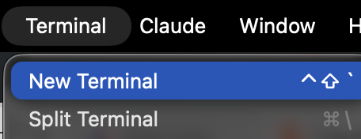

## Today's Session

::: {.step-flow}
::: {.step-card}
::: {.step-icon}
1
:::
::: {.step-title}
Academic Studio
:::
:::
::: {.step-card}
::: {.step-icon}
2
:::
::: {.step-title}
The Command Line
:::
:::
::: {.step-card}
::: {.step-icon}
3
:::
::: {.step-title}
CLAUDE.md and Skills
:::
:::
::: {.step-card}
::: {.step-icon}
4
:::
::: {.step-title}
Claude as a Teaching Assistant
:::
:::
:::

## Academic Studio {.section-divider}

## Where Academic Studio Fits {.shrink}

::: {.two-cards}
::: {.card-blue}

- Original Claude Code was CLI (command line interface)
- Millions of developers use Claude Code extension for VS Code
- VS Code = integrated development environment (IDE) from Microsoft
:::
::: {.card-amber}

Academic Studio = VS Code, except

- Removed menus and toolbar items aimed at developers
- Claude Code opens on startup
- Other extensions pre-installed
- New Claude menu and revised Help menu
:::
:::

## File Explorer and Search {.shrink}

Reach the File Explorer tool from the left toolbar.

::: {.two-cards}
::: {.card-blue}
[Files]{.card-title}

- Right-click to rename, copy, ...
- Double-click to open in Academic Studio viewer
- Viewer provides different options for different file types (cannot edit Office docs)

{width=62% fig-align="center"}
:::
::: {.card-amber}
[Search]{.card-title}

- The magnifying glass searches [inside every file]{.accent} in the folder at once
- Options for case, whole word, and regular expressions
- Replace across all files from the same pane

{width=92% fig-align="center"}
:::

:::

## Getting Around{.shrink}

::: {.three-cards}
::: {.card-blue}
[Conversations]{.card-title}

- Open a second Claude conversation for a separate task
- Each keeps its own context; they do not see each other
:::
::: {.card-amber}
[Terminal]{.card-title}

- Open from the Terminal menu, X to close
- Claude uses it too --- you will see commands run as it works

{width=88% fig-align="center"}
:::

::: {.card-purple}
[Remote SSH]{.card-title}

- Connect to jgsrc1 or a different remote server
- Files and code execution on remote server.  Academic Studio runs on your computer.
:::
:::

::: {.card-dark}
[Extensions]{.card-title}

VS Codium marketplace (all are free)
:::

## Permissions

{width=78% fig-align="center"}

## Some Claude Commands

::: {.comparison-table}

| Command | What it does |
|---|---|
| [/resume]{.accent} | a version of Claude/Conversations |
| [/model]{.accent} | select from Fable, Opus (default), Sonnet, and Haiku |
| [/clear]{.accent} | clear the context window (= new conversation) |
| [/compact]{.accent} | summarize the conversation in a text file, launch a new conversation that reads the text file |
| [Esc]{.accent} | escape key interrupts Claude, which then waits for new instructions |

:::

## Fit with VS Code 

- Independent apps, individual extensions and settings 
- They share Claude --- same CLAUDE.md, same skills, same conversation history 
- Example: Work on project in Academic Studio.  Then open in VS Code. [/resume]{.accent} brings up conversation history from Academic Studio.  

## The Command Line {.section-divider}

## Using a Terminal (Command Line)

- Windows: Command Prompt, Windows PowerShell, Windows Terminal
- Mac Terminal
- Open.  Then type commands.  Syntax must be right (not intelligent)

## What Claude Can Do at the Command Line

::: {.three-cards}
::: {.card .card-blue .fragment}
[File operations]{.card-title}

Move, copy, rename, delete, search within.

*Find all files in my Documents folder that discuss ... and move them to ...*
:::
::: {.card .card-amber .fragment}
[Install and run software]{.card-title}

*Run a python script, build a LaTeX doc, ...*
:::
::: {.card .card-teal .fragment}
[Interact with external services]{.card-title}

Command Line Interfaces (CLIs): `gh` for GitHub,  `aws` for Amazon Web Services, ...  Also, use APIs.
:::
:::

## More Things Claude Can Do at the Command Line

::: {.highlight-box}

- `pandoc` --- convert between Word, Markdown, HTML, PDF
- `ImageMagick` --- resize, crop, convert images in bulk
- `ffmpeg` --- trim video, transcode, pull the audio out
- `ripgrep` --- search thousands of files in seconds
- `cron` --- run a command on a schedule
:::

## Example: Git (Search the Past)

Git is a version control system.  A **commit** records the current state of a folder (repository=repo).  Git **is not** AI.  Git existed long before AI.  But AI knows Git.

::: {.code-box}
::: {.box-title}
Tell Claude
:::
Install Git.  Commit this folder to Git.
:::

Frequently, thereafter, tell Claude to commit changes.

##

At some point, you realize that you want to recover something from a version that was overwritten sometime in the past:

::: {.code-box}
::: {.box-title}
Tell Claude
:::
Find a prior version of ... that said ... Add that to the current version.
:::

## CLAUDE.md and Skills {.section-divider}

## CLAUDE.md

::: {.two-cards}
::: {.card .card-teal}
[Where Claude Looks]{.card-title}

- At the start of each conversation, Claude looks in specific places for CLAUDE.md files
- It looks in your home directory (C:\\users\\yourname on Windows) and it looks in the project folder
:::
::: {.card .card-purple}
[What It Is]{.card-title}

- A CLAUDE.md is a text file that contains instructions for Claude
- Claude reads the entire file, so use it sparingly
:::
:::

::: {.explainer}
You could get the same behavior by pasting the instructions in the prompt window
:::

## Skills

::: {.three-cards}
::: {.card .card-teal}
[At Startup]{.card-title}

At the start of each conversation, Claude also looks in specific places for SKILL.md files
:::
::: {.card .card-purple}
[Two Locations]{.card-title}

It looks in your home directory (C:\\users\\yourname on Windows) and it looks in the project folder
:::
::: {.card .card-dark}
[Loaded on Demand]{.card-title}

Skills are text files saved on your hard drive.  Claude reads the top of each SKILL.md file (the skill description) on startup, and it reads the bulk of the file [only when needed]{.accent}
:::
:::

## Installing Skills

::: {.two-cards}
::: {.card .card-teal}
[Where to Find Them]{.card-title}

- There are thousands of skills published on the internet.
- Anthropic publishes skills (xlsx, etc.) at [https://github.com/anthropics/skills/](https://github.com/anthropics/skills/){target="_blank"}
:::
::: {.card .card-purple}
[Ask Claude]{.card-title}

- To search for skills, ask Claude.  To install a skill you want, ask Claude.
- Other than a few of Anthropic's skills, the most useful skills are generally those you create, because they are customized to your work.
:::
:::

## Some Examples

I've looked at several skill repos for business/economics research.  Most are not useful.  Here are a couple I've adopted --- by Lu Han, Bank of Canada.

::: {.highlight-box}
- [Econ Writing](https://github.com/hanlulong/econ-writing-skill/tree/main/.claude/skills/econ-write){target="_blank"}: tells Claude to follow Cochrane's Writing Tips for PhD Students and some other style guides

- [Econ Paper Review](https://github.com/hanlulong/econ-paper-review-skill/tree/main/econ-review){target="_blank"}: writes a referee report on your paper
:::

Give Claude the links and ask Claude to install them if you want to try them out.

## Creating Skills

::: {.step-flow-3}
::: {.step-card}
::: {.step-icon}
1
:::
::: {.step-title}
Iterate
:::
::: {.step-desc}
Usual process is you work on something, iterating until you get what you want.
:::
:::
::: {.step-card}
::: {.step-icon}
2
:::
::: {.step-title}
Recognize
:::
::: {.step-desc}
You realize you may want the same thing again, and you don't want to go through the iteration again.
:::
:::
::: {.step-card}
::: {.step-icon}
3
:::
::: {.step-title}
Save the Recipe
:::
::: {.step-desc}
Solution: tell Claude to save the satisfactory method (recipe) as a skill.  Can save your result along with the skill as an example to follow if useful.
:::
:::
:::

## Invoking Skills

::: {.three-cards}
::: {.card .card-blue .fragment}
[Slash Command]{.card-title}

- Type `/skillname` at the prompt
- Example: `/plan`
- Invokes the skill directly
:::
::: {.card .card-amber .fragment}
[Natural Language]{.card-title}

- Describe what you need in plain English
- Example: "Use your planning mode and evaluate ..."
:::
::: {.card .card-teal .fragment}
[Automatic]{.card-title}

- Claude may invoke a skill on its own
- Example: "Create an Excel file" triggers the xlsx skill automatically
- Driven by the skill's description
:::
:::

## Example: Create and Invoke

::: {.step-flow-3}
::: {.step-card}
::: {.step-icon}
1
:::
::: {.step-title}
Create
:::
::: {.step-desc}
Tell Claude to create a skill for your folder named "pirate" with this content: "Always answer like a pirate"
:::
:::
::: {.step-card}
::: {.step-icon}
2
:::
::: {.step-title}
Invoke
:::
::: {.step-desc}
Start a new conversation.  Enter [/pirate What is the meaning of life?]{.accent}
:::
:::
::: {.step-card}
::: {.step-icon}
3
:::
::: {.step-title}
Inspect
:::
::: {.step-desc}
Ask Claude to show you the pirate SKILL.md
:::
:::
:::

## Claude as a Teaching Assistant {.section-divider}

## What can Claude Do?

::: {.two-cards}
::: {.card .card-blue .fragment}
- Draft slides
- Assist with editing slides
- Generate images for slides
- Draft quizzes and assignments
- Assist with grading
:::
::: {.card .card-amber .fragment}
- Draft emails to students
- Help create async materials
- Build tutors
- Build Excel workbooks
- Write cases
:::
:::

## Drafting and Editing Slides

Claude is generally able to create slide decks using whatever style you like.  Here is an example.

::: {.highlight-box}
- [SamplePresentation.pptx](../files/session2/SamplePresentation.pptx){target="_blank"} is a Microsoft template
- I asked Claude to remake tesla.pptx in that style
- The first draft: [tesla1.pptx](../files/session2/tesla1.pptx){target="_blank"}
- The second draft: [tesla2.pptx](../files/session2/tesla2.pptx){target="_blank"}
:::

Once it is successful, you can ask Claude to save the recipe as a skill to use thereafter.

::: {.explainer} 
When editing an existing deck, you will want Claude to automatically save changes and close an open deck before editing.  Then reopen for you to see (and edit) again.
:::

## A Skill to Create Deck Styles

::: {.step-flow-3}
::: {.step-card}
::: {.step-icon}
1
:::
::: {.step-title}
Install
:::
::: {.step-desc}
Ask Claude to install the House Decks plugin from [github.com/kerryback/skills](https://github.com/kerryback/skills){target="_blank"}
:::
:::
::: {.step-card}
::: {.step-icon}
2
:::
::: {.step-title}
Register a Style
:::
::: {.step-desc}
Start a new conversation.  Ask Claude to apply it to a PowerPoint deck written in your preferred style.  Give the style a name.
:::
:::
::: {.step-card}
::: {.step-icon}
3
:::
::: {.step-title}
Create a Deck
:::
::: {.step-desc}
Ask Claude to create a new deck in that style.
:::
:::
:::

::: {.explainer}
The PowerPoint deck contains elements that Claude will save and deploy again and fonts that it will try to match.  So, "create a deck in this style" is something Claude should be able to do, using the python-pptx Python library.
:::

## A Good Use of CLAUDE.md: Routing

::: {.highlight-box}
Skills announce when they apply, and sometimes two of them claim the same job. Anthropic's `pptx` skill triggers on [any]{.accent} PowerPoint file, so a skill of your own for your house style will collide with it. 
:::

::: {.card-dark}
Ask Claude to assist in editing CLAUDE.md globally or in a project folder to settle the precedence.
:::

## Exercises {.section-divider}

1.  Tell Claude to install Git and to initialize your project folder as a Git repo and to commit.  Make some changes, commit again, and ask about restoring the prior version.

2.  Pick a deck you want to refresh.  Ask Claude to read it and offer suggestions on content, organization, and style.  Ask Claude to edit some slides and to draft some slides, saving changes in a new name.

## Takeaway {.centered-statement}

::: {.card .card-dark}
Claude can work alongside you on whatever you're working on.  Get advice and suggestions.  Hand over the tedious part of the work.  Save good workflows as skills so they can be easily repeated.
:::