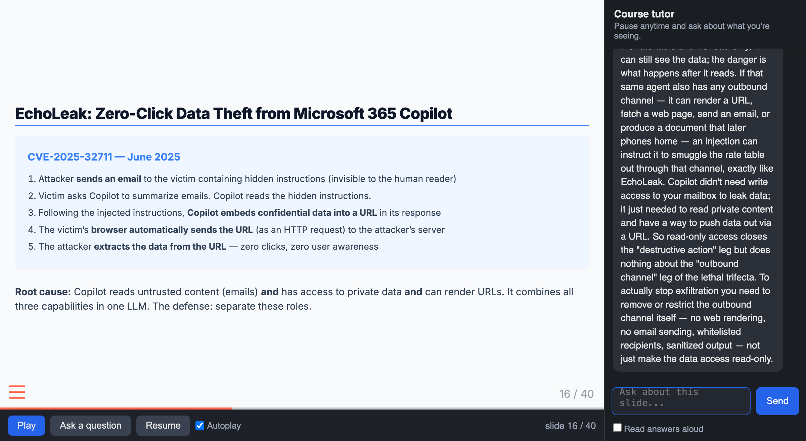

## Four Things You Can Now Make

::: {.four-cards}
::: {.card .card-blue}
[Slides]{.card-title}

Decks built from an outline, a paper, or a set of notes --- and restyled in one pass
:::
::: {.card .card-amber}
[Cases]{.card-title}

A fictional company, the numbers, the exhibits, and the teaching note --- generated together
:::
::: {.card .card-teal}
[Grounded chatbots]{.card-title}

A tutor grounded in your own materials --- from a no-build NotebookLM to a custom RAG bot, answering with citations
:::
::: {.card .card-purple}
[Voiceovers]{.card-title}

A narrated video or a self-paced tutorbot made from a deck you already have
:::
:::

::: {.explainer}
Each of these used to be days of work. Each is now a conversation. This session is a tour of how --- and every deck in this course was built the way we are about to describe.
:::

## Slides {.section-divider}

## These Slides Are the Example

::: {.two-cards}
::: {.card .card-blue}
[What they are]{.card-title}

- Plain-text [Quarto]{.accent} files rendered to reveal.js --- HTML slides that run in a browser
- One stylesheet controls every deck's look
- Export to PDF or PowerPoint when you need to hand them out
:::
::: {.card .card-amber}
[Why text, not PowerPoint]{.card-title}

- Claude writes and edits text natively --- so it can draft, restyle, and reorganize whole decks
- Change the stylesheet once; all eight decks update
- Version-controlled: every change is tracked and reversible
:::
:::

::: {.explainer}
The `slides` skill packages this: point Claude at notes, a paper, or an outline and it produces a styled deck with cards, callouts, and section dividers --- the components you have been looking at all session.
:::

## From Source to Deck

::: {.step-flow}
::: {.step-card}
::: {.step-icon}
📄
:::
::: {.step-title}
Give it source
:::
::: {.step-desc}
An outline, a paper, lecture notes, a transcript
:::
:::
::: {.step-card}
::: {.step-icon}
✍️
:::
::: {.step-title}
Draft
:::
::: {.step-desc}
Claude proposes a slide-by-slide structure
:::
:::
::: {.step-card}
::: {.step-icon}
🎨
:::
::: {.step-title}
Style
:::
::: {.step-desc}
Cards, dividers, diagrams applied from the theme
:::
:::
::: {.step-card}
::: {.step-icon}
📤
:::
::: {.step-title}
Export
:::
::: {.step-desc}
Present in browser; hand out as PDF or PPTX
:::
:::
:::

::: {.explainer}
You stay in the loop at each step --- approving the structure before the polish, and the polish before the export.
:::

## Cases {.section-divider}

## Generating a Case

::: {.two-cards}
::: {.card .card-blue}
[From concept to case]{.card-title}

- Start with the concept a session teaches
- Build a fictional company and a decision that turns on that concept
- Plant one hook for every idea, so a student who understood the material can find them all
:::
::: {.card .card-amber}
[What AI drafts]{.card-title}

- The company, the numbers, the exhibits, the competing memos
- Realistic artifacts --- contracts, data tables, email threads
- The teaching note, cold-call bank, and rubric alongside the case
:::
:::

::: {.explainer}
Your job shifts from writing prose to designing the decision --- and checking that every concept has exactly one landmine.
:::

## Example: Trinity Freight

::: {.card .card-blue}
Built to test an AI-security session. A freight brokerage's CFO must approve, reject, or redesign an AI quoting agent. Every security concept has one hook in the case.
:::

::: {.three-cards}
::: {.card .card-dark}
[The decision]{.card-title}

Approve a $5M-opportunity AI agent --- or catch why the design is dangerous
:::
::: {.card .card-light}
[The exhibits]{.card-title}

Architecture, data inventory, the vendor's security overview, the economics
:::
::: {.card .card-dark}
[The hook]{.card-title}

One exhibit is an ordinary-looking RFQ email with a prompt injection buried in it
:::
:::

::: {.explainer}
A student who absorbed the session sees the trap in the email. A polished memo that recommends approval and never mentions it has, in effect, approved the breach.
:::

## Two Versions, Generated Together

::: {.two-cards}
::: {.card .card-blue}
[Version A --- write the recommendation]{.card-title}

- Student plays the CFO and makes the call
- Finds the risks, proposes a redesign, defends the tradeoffs
- Ships with: assignment questions, cold-call bank, grading rubric
:::
::: {.card .card-amber}
[Version B --- critique the AI's memo]{.card-title}

- Student is handed a fluent, confident, subtly wrong AI memo
- Evaluates it rather than writing their own
- Ships with: the AI recommendation, the answer key, the questions
:::
:::

::: {.explainer}
Both versions --- the case, the exhibits, the teaching materials, the answer key --- came out of the same generation pass. We keep them under version control and edit the parts the model got not-quite-right.
:::

## RAG Chatbots {.section-divider}

## Grounding a Bot in Your Material

::: {.two-cards}
::: {.card .card-blue}
[One deck: just show it]{.card-title}

- A single session's script is small enough to hand the model in full, every time
- No search, no database --- the material is simply there
- This is how the tutorbot we will see works
:::
::: {.card .card-amber}
[A whole course: too big]{.card-title}

- Every deck, reading, and case won't fit in one prompt
- The bot must fetch only the relevant piece for each question
- This is what [RAG]{.accent} does
:::
:::

::: {.explainer}
Retrieval-Augmented Generation: the model answers from *your* sources instead of its memory --- so it stays current with your material and every answer can be checked.
:::

## RAG in One Picture

::: {.three-cards}
::: {.card .card-dark}
[Prepare]{.card-title}

Split your documents into chunks, turn each into a numeric "embedding," and store them in a database
:::
::: {.card .card-light}
[Retrieve]{.card-title}

For a question, find the chunks most similar to it and hand them to the model
:::
::: {.card .card-dark}
[Answer]{.card-title}

The model responds grounded in those chunks --- and can cite which document each came from
:::
:::

::: {.explainer}
The Harvard course bots --- ChatLTV on 200 documents, an accounting tutor on a whole course --- are RAG bots for exactly this reason.
:::

## The No-Build Path

::: {.two-cards}
::: {.card .card-blue}
[Google NotebookLM]{.card-title}

- Upload up to 50 sources --- PDFs, Google Docs, web links, YouTube
- Answers grounded in your sources, with citations
- Generates study guides and [audio overviews]{.accent} --- a narrated summary
- Free with a Google account
:::
::: {.card .card-amber}
[Claude & ChatGPT Projects]{.card-title}

- Upload documents to a Project; the assistant searches them across every chat
- RAG without writing any code
- Requires a subscription
:::
:::

::: {.explainer}
For a manageable pile of documents, these are an instant grounded tutor. Build your own only when you need to search thousands of documents, embed it in an app, or control the pipeline.
:::

## NotebookLM {.section-divider}

## Upload Your Sources, Get an Assistant

::: {.two-cards}
::: {.card .card-blue}
[Grounded in what you upload]{.card-title}

- Drop in your own sources --- PDFs, slides, Google Docs, web links, even YouTube videos
- The assistant answers from *those* sources and [cites]{.accent} them
- Stays on your content instead of the open web --- far less prone to making things up
:::
::: {.card .card-amber}
[Study aids on demand]{.card-title}

- Auto-generates a study guide, an FAQ, a briefing doc, a timeline
- All drawn from the material you gave it
- Free, with a Google account --- no code, no setup
:::
:::

::: {.explainer}
Google's NotebookLM is the no-build way to hand students a course-grounded assistant: upload the readings and share. No pipeline to build, nothing to embed.
:::

## The Audio Overview

::: {.two-cards}
::: {.card .card-blue}
[A podcast of your material]{.card-title}

- Its signature feature: a two-host [Audio Overview]{.accent}
- Two AI voices discuss your sources in a surprisingly natural conversation
- Students can listen to a lecture's readings as a discussion
:::
::: {.card .card-amber}
[The no-build teaching assistant]{.card-title}

- Upload and share --- no engineering, no setup
- The zero-code option; a built RAG bot is the customizable one
- Great when you want course-grounded chat and audio, fast
:::
:::

::: {.explainer}
Where a RAG bot you build gives you control of the pipeline, NotebookLM gives you a grounded tutor and a listenable audio overview in minutes --- two ends of the same idea.
:::

## Voiceovers & Tutorbots {.section-divider}

## From Deck to Narrated Video

::: {.two-cards}
::: {.card .card-blue}
[The idea]{.card-title}

- Claude drafts a spoken narration script for each slide
- A text-to-speech voice reads it; the audio is synced to the slides
- Out comes an MP4 --- a narrated video --- plus the transcript
:::
::: {.card .card-amber}
[Why bother]{.card-title}

- Students who missed class, or want a second pass, get the lecture on demand
- The transcript is searchable and accessible
- You record nothing --- and re-generate in minutes when the slide changes
:::
:::

::: {.explainer}
The `voiceover` skill does exactly this: give it a PDF deck, pick a voice, and it returns the video and transcript.
:::

## The Tutorbot: A Video That Answers Back

{width=88% fig-align="center"}

::: {.explainer}
The slides play with AI voiceover and advance on their own. The student can pause at any moment and ask a question --- here, "if the agent only has read-only access, how can an injection steal our data?" --- and the tutor answers in context, then class resumes.
:::

## How the Tutorbot Is Built

::: {.four-cards}
::: {.card .card-dark}
[Narrated deck]{.card-title}

Each slide carries a spoken script, pre-generated to one audio clip per slide
:::
::: {.card .card-light}
[Player]{.card-title}

Slides plus synced audio; pause, ask, resume; auto-advances when a clip ends
:::
::: {.card .card-dark}
[Tutor]{.card-title}

Claude answers with the full narration as context, and knows which slide you are on
:::
::: {.card .card-light}
[Question log]{.card-title}

Every question saved with its slide number --- next class's cold-call material
:::
:::

::: {.explainer}
Anchored, not caged: the tutor is grounded in the deck's script but free to draw on general knowledge --- and it signposts when it goes beyond the session.
:::

## Made Repeatable: a Skill

::: {.card .card-blue}
The whole process is packaged as a Claude skill, `tutorbot-builder`. Point it at a deck and it produces the narrated tutorbot --- deck, narration, audio, player, and tutor backend --- no code required.
:::

::: {.three-cards}
::: {.card .card-dark}
[Any deck in]{.card-title}

PowerPoint, PDF, or reveal.js / Quarto
:::
::: {.card .card-light}
[Convert if needed]{.card-title}

PowerPoint and PDF are turned into slides first; Claude reads each to draft narration
:::
::: {.card .card-dark}
[Tutorbot out]{.card-title}

Narrated, interruptible, self-paced --- ready to assign before class
:::
:::

::: {.explainer}
A skill is codified expertise you write once and reuse --- the subject of our next-to-last session. It is shareable: any instructor can install it and convert their own decks.
:::

## The Payoff {.centered-statement}

::: {.card .card-dark}
Slides, cases, a grounded tutor, a narrated lecture --- each was once days of work and is now a conversation. The scarce thing is no longer *making* the content. It is [deciding what to make and judging whether it is good.]{.accent}
:::

## Breakout {.section-divider}

## Questions to Discuss

- Which of your existing decks would you turn into a narrated tutorbot first?
- What concept in your course would make the best case --- and what artifact would carry its central hook?
- Do you have a document pile (readings, notes, past exams) that a grounded chatbot could answer from?
- Where would AI-drafted content still need your hand before it reached students?
