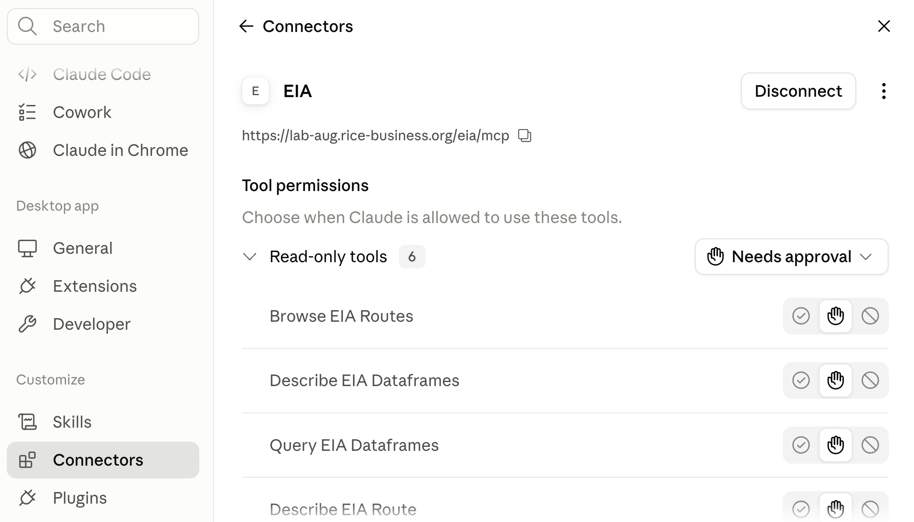

## Enterprise Adoption

::: {.comparison-table}

| | Anthropic | OpenAI | Google | Open Source |
|---|---|---|---|---|
| **Enterprise LLM spend** (Menlo) | [**40%**]{.amber} | 27% | 21% | 12% |
| **Company usage** (Datadog) | ~46% (+23 pts YoY) | [**63%**]{.accent} of companies | ~37% (+20 pts YoY) | 13% of workloads |
| **Code generation** (Menlo) | [**54%**]{.amber} | 21% | ? | ? |

:::

::: {.explainer}
Anthropic is #1 by enterprise spend; OpenAI is #1 by breadth of adoption. The default enterprise strategy is [multi-model]{.accent} --- 69% of companies use 3+ models, routing different tasks to different providers. Closed-source models power 85--90% of enterprise workloads.
:::


## Corporate Applications

::: {.three-cards}
::: {.card .card-blue}
[Talk to Company Data]{.card-title}

Agent writes SQL and Python to generate tables, figures, and docs in response to user prompts
:::
::: {.card .card-teal}
[Talk to Company Documents]{.card-title}

Embed doc chunks in a vector database; find similar chunks and add to the prompt for LLM analysis
:::
::: {.card .card-amber}
[Take Actions]{.card-title}

Give the agent tools to update an ERP, file a ticket, send an invoice
:::
:::


## Prompt Injection Risk

::: {.highlight-box}
An injection is an instruction hidden in text the model reads --- a web page, an email, an uploaded file. All three applications can be hijacked by one: data exfiltrated, analysis corrupted, improper actions taken.
:::


## Solution

Isolation from untrusted sources, by two complementary paths:

::: {.two-cards}
::: {.card .card-blue}
[Restrict the tools]{.card-title}

- The agent gets only the tools its job needs
- No web tools: no page an attacker controls enters the context, and nothing carries data out
- A tool the agent does not have cannot be talked into use
:::
::: {.card .card-teal}
[Restrict egress]{.card-title}

- Run the agent in a container whose network reaches an allowlist of hosts and nothing else
- Guards even code the model writes and the agent executes
:::
:::


## Today's Session

::: {.step-flow-6}
::: {.step-card .fragment}
::: {.step-icon}
1
:::
::: {.step-title}
API Calls
:::
::: {.step-desc}
Keys and billing, and what the raw API does not come with
:::
:::
::: {.step-card .fragment}
::: {.step-icon}
2
:::
::: {.step-title}
Build a Chatbot
:::
::: {.step-desc}
Two prompts to build, two to deploy --- then the RAG version
:::
:::
::: {.step-card .fragment}
::: {.step-icon}
3
:::
::: {.step-title}
AI Agents
:::
::: {.step-desc}
A chatbot with tools, and the three kinds the SDK offers
:::
:::
::: {.step-card .fragment}
::: {.step-icon}
4
:::
::: {.step-title}
Connectors
:::
::: {.step-desc}
MCP, and adding one to Claude Desktop yourself
:::
:::
::: {.step-card .fragment}
::: {.step-icon}
5
:::
::: {.step-title}
Build an Agent
:::
::: {.step-desc}
An energy data agent, in a container with no way out
:::
:::
::: {.step-card .fragment}
::: {.step-icon}
6
:::
::: {.step-title}
An AI Business
:::
::: {.step-desc}
Sell it per seat, and defend the margin on cheaper models
:::
:::
:::

::: {.explainer}
The same two questions run through every step: which tools does it have, and what can it reach?
:::

## API Calls {.section-divider}


## Python Code for an API Call

```
import anthropic

client = anthropic.Anthropic()          # reads ANTHROPIC_API_KEY from .env

response = client.messages.create(
    model="claude-opus-4-5",
    max_tokens=1024,
    system="You are a research assistant for a finance department.",
    messages=[{"role": "user", "content": "Summarize the Fama-French factors."}],
)

print(response.content[0].text)
```

::: {.explainer}
That is the whole API. You supply the model, the system prompt, and the messages; you get text back. The `system` line is there only because we put it there --- omit it and the model is given no instructions at all.
:::


## What Does Not Come With It

::: {.four-cards}
::: {.card .card-red}
[No system prompt]{.card-title}

Nothing tells the model who it is, what it may refuse, or what house style to use. The field is empty until you fill it.
:::
::: {.card .card-red}
[No conversation]{.card-title}

Each call is answered in isolation. The model has no idea you spoke to it thirty seconds ago.
:::
::: {.card .card-red}
[No tools]{.card-title}

No web search, no file reading, no code execution. It reads text and writes text.
:::
::: {.card .card-red}
[No memory]{.card-title}

Nothing is stored between calls. No history, no preferences, no notes about you.
:::
:::

::: {.card-dark}
Claude Desktop and Claude Code are *applications* built on this API. The system prompt, the running conversation, the tools, the memory are things Anthropic wrote on top. 
:::


## API Keys

::: {.four-cards}
::: {.card .card-blue}
[Get one]{.card-title}

At [console.anthropic.com](https://console.anthropic.com) --- a separate account from claude.ai
:::
::: {.card .card-teal}
[Per-token billing]{.card-title}

Billed per token used, separate from your subscription
:::
::: {.card .card-amber}
[No subscription needed]{.card-title}

You don't need a Claude subscription to get an API key, just a credit card
:::
::: {.card .card-red}
[It is a credential]{.card-title}

Equivalent to a username and password --- you are billed for anyone who uses it
:::
:::

## Claude Enterprise Agreements 

- Billing is per token, like API key accounts
- Data processing agreement (and BAA for HIPAA): contractual agreement to protect data, including "do not train" and zero retention

::: {.info-box}
[Harness rental]{.box-title}

- Additional charge per seat to use Claude Chat, Cowork, and Code
- A company could build its own Chat/Cowork/Code version or use open-source versions (OpenCode) to avoid the seat charges
:::


## An Agent Harness

{width=75% fig-align="center"}


## Build a Chatbot {.section-divider}


## Build Bill and Ted

Let's start with chatbots, since an agent is just a chatbot with tools.

::: {.card-dark}
::: {.card-title}
Prompt
:::
Build a FastAPI chatbot.   I want the chatbot to always answer like Bill and Ted.   Use the billandted.png image.  Use my OpenRouter key in .env and use the Deepseek chat model.
:::

## Deploy Bill and Ted

With some (easy) initial setup, it is also very easy to deploy it.  Free Koyeb account is available.  In corporate practice, hand to IT.

::: {.card-dark}
::: {.card-title}
Prompt
:::
Create a git repo for the app and push to github as kerryback/billandted.  Then create a Koyeb app in the kerrybackapps organization and link the repo.  Create a billandted.kerryback.com CNAME record on DN Simple and set it as the custom domain.
:::

[billandted.kerryback.com](https://billandted.kerryback.com)


## RAG (Retrieval Augmented Generation) Chatbot

Important category of corporate chatbots.  NotebookLM uses this technology.

::: {.three-cards}
::: {.card .card-blue}
[Chunk and Embed]{.card-title}

Split documents into chunks, assign each chunk a vector, store vectors in a database.  
:::
::: {.card .card-teal}
[Similarity Matching]{.card-title}

When a prompt is entered, program (not AI) maps it to a vector and finds the closest chunks in the database.

:::
::: {.card .card-amber}
[Prompt Augmentation]{.card-title}

Chatbot hands chunks and prompt to the LLM.  
:::
:::


## Secure RAG Chatbot

Two boundaries make a RAG chatbot secure:

::: {.two-cards}
::: {.card .card-blue}
[Limited ingress]{.card-title}

- Add a login to the app: employees sign in with company credentials
- Or stronger: deploy on company network, unreachable from outside; remote workers arrive by VPN
:::
::: {.card .card-teal}
[Limited egress]{.card-title}

- The chatbot needs to reach exactly two hosts: the Anthropic API and its vector database
- Give it no web tools, and run it in a container whose only exits are those two 
:::
:::


## AI Agents {.section-divider}


## What Is an Agent?

::: {.highlight-box}
- The chatbot is not an agent --- it reads text and writes text
- An app with a menu is not an agent either. Given the same menu choice, it does the same thing every time
:::

::: {.card-dark .fragment}
An agent is an app that takes actions at the discretion of an LLM.  The action could be: search the web, run Python, draft an email, ...
:::


## Claude Agent SDK

Easy way to create agent.  Python (or TypeScript) library that defines three types of tools:

::: {.three-cards}
::: {.card .card-blue}
[Built-ins]{.card-title}

The tools Claude Code has --- Read, Write, Edit, Bash, WebSearch, WebFetch 
:::
::: {.card .card-teal}
[Internal MCP tools]{.card-title}

Python functions you write, exposed to the model as tools 
:::
::: {.card .card-amber}
[External MCP tools]{.card-title}

Connectors --- MCP servers to connect to your databases, your inbox, a public data source
:::
:::

## Connectors {.section-divider}

## MCP (Model Context Protocol)

Introduced by Anthropic in November 2024.  Adopted by OpenAI and Google in spring 2025.

::: {.three-cards}
::: {.card .card-blue}
[The problem it solves]{.card-title}

Simplifies connecting an AI to external services --- data, email, calendars, ticketing
:::
::: {.card .card-teal}
[Server is a middleman]{.card-title}

Details of how to connect to a service are coded into an MCP server, which is always on
:::
::: {.card .card-amber}
[Exposes tools, uses them]{.card-title}

Server exposes tools (text descriptions) to the AI, then translates each tool call programmatically into service usage
:::
:::

## Adding a Connector in Claude Desktop

::: {.three-cards}
::: {.card-blue}
[Step 1]{.card-title}

- Home/Customize
- View defaults to Skills page
- Scroll down  left sidebar to  Connectors
:::
::: {.card-amber}
[Step 2]{.card-title}

- Choose Add/Browse Connectors
- Look around
- Close window (X at top right)
:::

::: {.card-teal}
[Step 3]{.card-title}

- Choose Add/Add Custom Connector
- Name → EIA
- URL → https://eia.rice-business.org/mcp
- Click Connect
:::
:::


## Should Get Here

{width=62% fig-align="center"}


## Back to Building Agents {.section-divider}


## Claude Prompt

::: {.card-dark}
::: {.card-title}
Prompt
:::
Using the claude_agent_sdk, create a FastAPI agent app called eia_agent.py that connects to the EIA MCP server at https://eia.rice-business.org/mcp.  Create an internal MCP server exposing one tool, run_python, that executes Python for calculations and charts, restricting imports to the data analysis stack and returning charts inline in the chat. The system prompt should say the agent is an energy data analyst and should politely decline questions unrelated to energy data. Set tools=[], permission_mode to dontAsk, and max_turns to 15, and include all of the EIA MCP server's tools and run_python in allowed_tools.
:::

::: {.explainer}
`tools=[]` means keep none of the built-in Claude agent tools. [eia.kerryback.com](https://eia.kerryback.com)
:::


## Containerize

Even without `webFetch` and `webSearch`, this agent could reach the web via Python, which can execute arbitrary terminal commands.  So, it needs to live in a container with limited egress.


## Example Stack

{width=88% fig-align="center"}


## Build an AI  Business {.section-divider}


## The Business

::: {.two-cards}
::: {.card .card-blue}
[The product]{.card-title}

- A custom agent behind a web page, sold to a niche you know --- leasing agents, estate lawyers, clinic managers
- Your system prompt, your tools, your document corpus: the session's whole toolkit, aimed at one trade
- Customers log in and pay you a monthly subscription
:::
::: {.card .card-amber}
[The economics]{.card-title}

- Customers pay you per seat per month; you pay Anthropic per token
- The margin is the spread, and it moves with usage --- a heavy user can cost more than they pay
- Prompt caching, spending caps, and cheaper models are how you defend it
:::
:::


## OpenRouter Provides > 500 Models

Get an OpenRouter API key at [openrouter.ai](https://openrouter.ai).  

Providers bill OpenRouter.  You pay OpenRouter (one key, many models).  

Connect your agent or use their chatbot.

Model list and pricing: [openrouter.ai/models](https://openrouter.ai/models)

## Run a Model Locally

- For maximum data security, to reduce costs, or to fine tune --- small model trained for your task may be cheap, fast, and accurate
- Hardware to run largest models = $ millions, to run smallest = laptop
- Download a model from Hugging Face.  Millions of models.  [huggingface.co/](https://huggingface.co/)
- Download and run a model with Ollama.  

::: {.card-dark}
::: {.card-title}
Prompt
:::
Install ollama.  Run gemma4:e4b.
:::


