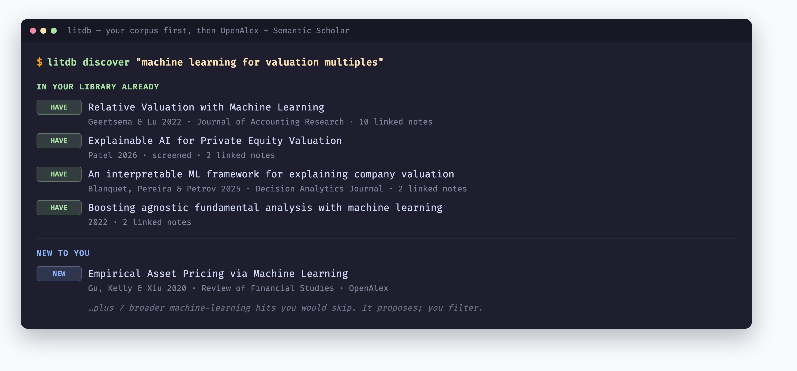
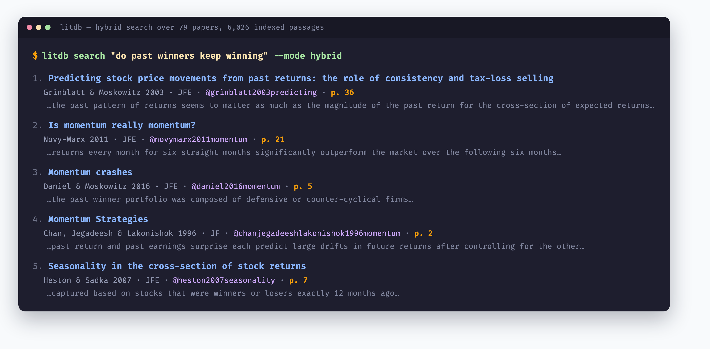
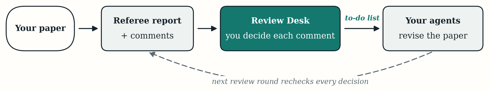
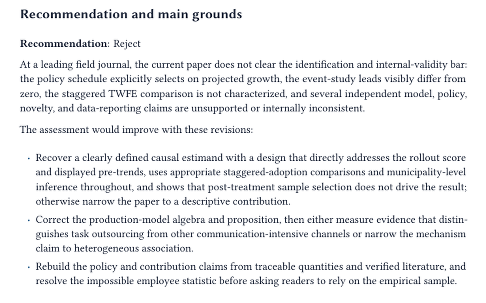
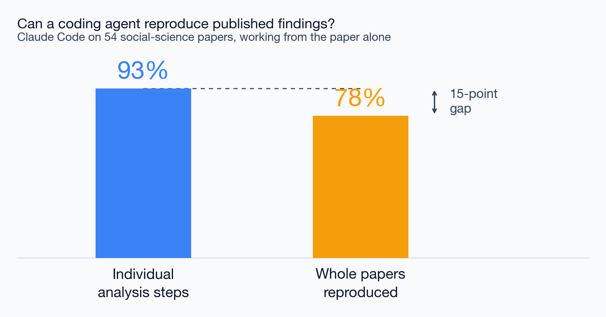

## The Research Loop, Assisted

::: {.three-cards}
::: {.card .card-blue}
[Find]{.card-title}

- Discover and track the literature
- Follow citations forward and back
:::
::: {.card .card-amber}
[Organize]{.card-title}

- A private, searchable library of what you have read
- Search by keyword *and* by meaning
:::
::: {.card .card-teal}
[Write & review]{.card-title}

- Draft and edit with field-aware guidance
- Referee your own work before a journal does
:::
:::

::: {.explainer}
Each move has a tool you can install today. AI does the search, the recall, and the first pass; the judgment stays yours.
:::

## Literature Search {.section-divider}

## Finding and Tracking Work

::: {.two-cards}
::: {.card .card-blue}
[Ask, don't keyword]{.card-title}

- Describe what you want in plain language
- Discovery across [OpenAlex]{.accent} and [Semantic Scholar]{.accent}
- Papers and abstracts, not a list of links
:::
::: {.card .card-amber}
[Follow the citations]{.card-title}

- What does this paper cite? Who cites it?
- Trace a result forward to its critics and back to its roots
- Surface the branch you were missing
:::
:::

## Corpus First, Then the World {.top-aligned}

::: {.explainer}
It marks what I already hold before proposing anything new --- and most of what it proposes, I skip.
:::

## Knowledge Databases {.section-divider}

## Your Own Library, Searchable

::: {.stat-cards}
::: {.stat-card}
[79]{.stat-number}
[Papers, 66 with full text]{.stat-label}
:::
::: {.stat-card}
[6,026]{.stat-number}
[Indexed passages]{.stat-label}
:::
::: {.stat-card}
[3,812]{.stat-number}
[Citation links]{.stat-label}
:::
:::

::: {.two-cards}
::: {.card .card-blue}
[What it is]{.card-title}

- Local, private store of your PDFs and notes
- Import a Zotero library or a folder of PDFs
:::
::: {.card .card-amber}
[Why it helps]{.card-title}

- "What do I have on X?" --- answered in seconds
- Notes tied to the papers that prompted them
:::
:::

::: {.explainer}
My actual numbers, from the `litdb` skill --- plus 64 notes linked to the papers that prompted them. It runs locally; the library never leaves the machine.
:::

## Search by Meaning, Not by Keyword {.top-aligned}

::: {.explainer}
No title contains a word from the query. Hybrid search matches the *idea*, and returns the page it came from.
:::

## Writing {.section-divider}

## Drafting and Editing

::: {.two-cards}
::: {.card .card-blue}
[Field-aware help]{.card-title}

- Structure, argument, and clarity for an economics paper
- Synthesized from 50+ guides by working economists
- Section by section: intro, results, response to referees
:::
::: {.card .card-amber}
[Sound human, not machine]{.card-title}

- Vary the rhythm; drop the AI tells
- Let the argument drive the structure, not a template
- Edit an existing draft, or draft from your notes
:::
:::

::: {.explainer}
The `econ-write` and `human-write` skills. They do not invent your findings --- they help you say what you found, well.
:::

## Reviews {.section-divider}

## Referee Before the Referee {.top-aligned}

::: {.two-cards}
::: {.card .card-blue}
[You decide each comment]{.card-title}

Accept, reject, or defer --- the report proposes, you dispose
:::
::: {.card .card-amber}
[The loop closes]{.card-title}

The next review round rechecks every decision you made
:::
:::

## What It Actually Produces {.top-aligned}

::: {.explainer}
A real report on a real paper --- a recommendation, and the grounds for it.
:::

## Every Comment, Anatomized

::: {.four-cards}
::: {.card .card-blue}
[Issue]{.card-title}

What is wrong, in one sentence
:::
::: {.card .card-amber}
[Relevant text]{.card-title}

The passage in your draft it comes from
:::
::: {.card .card-teal}
[Concern]{.card-title}

Why it threatens the paper's claim
:::
::: {.card .card-purple}
[Suggestions]{.card-title}

What would fix it, concretely
:::
:::

::: {.explainer}
Twenty comments in this structure, each traceable back to a line in the draft --- so you can argue with any one of them.
:::

## Others Have Built These Too

::: {.two-cards}
::: {.card .card-teal}
[Pedro Sant'Anna]{.card-title}

- A full paper-lifecycle suite
- Adversarial critic-fixer loop
:::
::: {.card .card-purple}
[Lee Crawfurd]{.card-title}

- Tightly-scoped review skills
- Replication-audit tooling
:::
:::

::: {.highlight-box}
Installable, mostly built by economists --- Claude as [copilot, not pilot]{.accent}.
:::

## The Risk That Matters Most

::: {.card .card-red}
The biggest academic danger with AI is [fabricated references]{.accent} and claims a cited source does not actually support. The better research skills attack this head-on.
:::

::: {.three-cards}
::: {.card .card-dark}
[Verify every citation]{.card-title}

Checked against Semantic Scholar, OpenAlex, Crossref, arXiv --- bogus DOIs caught before export
:::
::: {.card .card-light}
[Audit every claim]{.card-title}

Does the source actually support the sentence? High-severity violations block the output
:::
::: {.card .card-dark}
[Flag contamination]{.card-title}

Detect citations that may themselves be AI-invented
:::
:::

## Does It Actually Work? {.top-aligned}

## What the Gap Teaches

::: {.two-cards}
::: {.card .card-blue}
[Extraordinary at the parts]{.card-title}

- It nails each individual analysis step
- Load the data, run the spec, build the table
:::
::: {.card .card-amber}
[Not yet trusted end to end]{.card-title}

- One broken step anywhere fails the whole reproduction
- Exactly where human oversight stays essential
:::
:::

::: {.highlight-box}
The 93/78 split is the honest picture --- and the reason you check the chain, not just the links.
:::

## The Payoff {.centered-statement}

::: {.card .card-dark}
AI handles the [search, the recall, and the first pass]{.accent} --- finding the literature, remembering what you read, drafting the prose, refereeing the draft. You decide [what matters and whether it is right.]{.accent}
:::

## Breakout {.section-divider}

## Questions to Discuss

- Where in your own research does recall of the literature slow you down most?
- What would you keep in a private knowledge base that you would never put in a public tool?
- Which is riskier to hand to AI --- the drafting, or the reviewing? Why?
- Given the 93/78 result, which parts of your empirical work would you let AI run, and which would you always check yourself?
