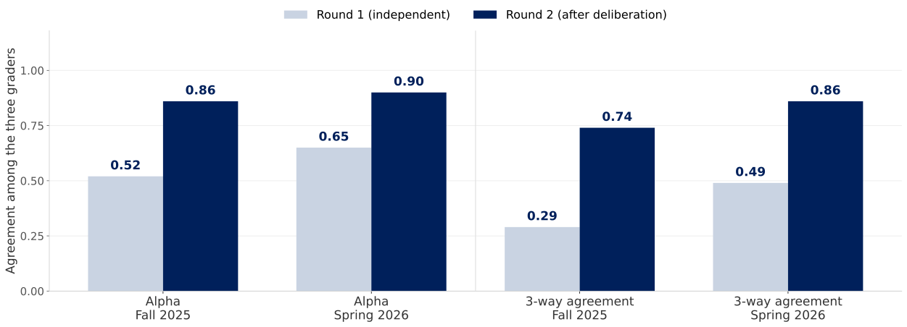
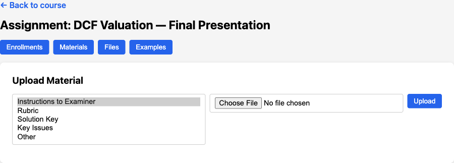

## The Thing We Never Have Time For

::: {.two-cards}
::: {.card-blue}
[Writing]{.card-title}

- Real comments take 20--40 minutes a paper
- They arrive after the student has moved on
- So we write fewer, shorter, later
:::
::: {.card-amber}
[Presentations]{.card-title}

- Graded live, from memory, while the next team sets up
- The student gets a number and a sentence
- Nobody re-watches a 12-minute talk
:::
:::

::: {.punchline .fragment}
Feedback is not a knowledge problem. It is a [minutes problem]{.accent} --- and minutes are exactly what these tools sell.
:::

## Three Different Things Called "AI Feedback"

::: {.three-cards}
::: {.card-teal}
[Coach the delivery]{.card-title}

- Filler words, pace, eye contact, hedging
- Knows nothing about your subject
:::
::: {.card-purple}
[Score against a rubric]{.card-title}

- Reads the artifact, applies criteria, writes comments
- Only as good as the rubric it is given
:::
::: {.card-red}
[Probe the understanding]{.card-title}

- Asks the student questions and grades the answers
- The one that resists being outsourced to AI
:::
:::

::: {.explainer}
Most products do exactly one of these. Confusing them is how a department buys a filler-word counter and wonders why it never says anything about the argument.
:::

## The Landscape {.section-divider}

## Delivery Coaches

::: {.two-cards}
::: {.card-light}
[The tools]{.card-title}

- Yoodli --- pacing, filler words, interview and pitch role-play
- Orai --- mobile, gamified, cheapest of the group
- VirtualSpeech --- VR audience, simulated room
- Speaker Coach --- already inside PowerPoint and Teams
:::
::: {.card-dark}
[What you get]{.card-title}

- Practice reps with no human in the room
- Metrics a student can move in a week
- [Nothing about whether the analysis is right]{.accent}
:::
:::

::: {.explainer}
Adoption is real: UW-Seattle funds Yoodli for every student out of the tech fee. Cheap, useful, and orthogonal to what we grade.
:::

## Rubric Graders for Writing

::: {.stat-cards}
::: {.stat-card}
[16,000]{.stat-number}

[Turnitin customers]{.stat-label}
:::
::: {.stat-card}
[2,600+]{.stat-number}

[Universities on Feedback Studio]{.stat-label}
:::
::: {.stat-card}
[LTI 1.3]{.stat-number}

[Grades flow into Canvas]{.stat-label}
:::
:::

::: {.two-cards}
::: {.card-blue}
[The incumbents]{.card-title}

- Turnitin Feedback Studio, plus Gradescope for problem sets and handwriting
:::
::: {.card-amber}
[The challengers]{.card-title}

- CoGrader, GradingPal, GradeWithAI --- upload a class set, attach a rubric, get comments per student
:::
:::

## Turnitin Changed What It Grades

::: {.highlight-box}
Clarity does not score the essay. It records the writing of it --- version-history playback, pasted-text flags, active writing time.
:::

::: {.punchline .fragment}
When the product is cheap to fake, the process becomes the evidence. That is a different assessment design, not a better detector.
:::

::: {.explainer}
TIME named Clarity one of its Best Inventions of 2025. Detection-first products are quietly repositioning as process-visibility products.
:::

## AISSA --- Rubric Feedback on Slides

::: {.stat-cards}
::: {.stat-card}
[90]{.stat-number}

[Presentations graded]{.stat-label}
:::
::: {.stat-card}
[$0.06]{.stat-number}

[Per evaluation]{.stat-label}
:::
::: {.stat-card}
[1--3 min]{.stat-number}

[Turnaround per deck]{.stat-label}
:::
:::

::: {.two-cards}
::: {.card-teal}
[How it works]{.card-title}

- Teacher builds a 5-point rubric in a dashboard
- Student uploads the deck before presenting
- Scores per criterion plus written strengths and fixes
:::
::: {.card-purple}
[The pilot]{.card-title}

- 46 final-year engineering students, Universidad Autónoma de Madrid
- Usability 83 on the SUS scale
- No comparison against human graders yet
:::
:::

## NYU Stern Built Ours Before We Did

::: {.step-flow-3}
::: {.step-card}
::: {.step-title}
Voice exam
:::
::: {.step-desc}
Identity check, then 8--10 minutes on the student's own project and 8--10 on a case
:::
:::
::: {.step-card}
::: {.step-title}
Three graders
:::
::: {.step-desc}
Claude, Gemini and GPT-5 score the transcript on five 0--4 dimensions, citing verbatim evidence
:::
:::
::: {.step-card}
::: {.step-title}
Chair decides
:::
::: {.step-desc}
They read each other, revise, and Claude synthesizes the final 0--20 grade and feedback
:::
:::
:::

::: {.explainer}
Two cohorts of an AI/ML product management course: 36 students in Fall 2025, 37 in Spring 2026. Published as arXiv 2603.18221.
:::

## Making Them Argue Is What Works {.top-aligned}

{width=1600}

::: {.explainer}
NYU Stern's Viva: agreement among the three grading models, before and after they read each other's assessments. Krippendorff's alpha on the left, share of items with all three in exact agreement on the right.
:::

## What It Cost Them

::: {.comparison-table}

| | AI oral exam | Human oral exam |
|---|---|---|
| Grading | $0.29--0.96 per exam | --- |
| All-in, 25--30 minutes | ~$3.40 per exam | ~$21 per exam |
| Scheduling | Student picks a slot at 11pm | Two graders in a room |
| Consistency | Same examiner for all 37 | Drifts across a long day |

:::

::: {.punchline .fragment}
The interesting number is not the cost. It is that every student got a [live oral exam at all]{.accent}.
:::

## And Students Did Not Love It

::: {.three-cards}
::: {.card-blue}
[Worked]{.card-title}

- 66--70% agreed it tested actual understanding
:::
::: {.card-amber}
[Hurt]{.card-title}

- 83% found it more stressful than a written exam --- down to 63% after fixes
:::
::: {.card-red}
[Preferred]{.card-title}

- Given the choice: 53% written, 25% AI oral, 19% human oral
:::
:::

::: {.explainer}
Their biggest fixable complaint was question stacking --- the agent asking two things at once. It fell from 31% of turns to 11% once the prompt forbade it. We hit the same bug; the fix is in our prompts too.
:::

## Why Oral Exams Came Back

::: {.two-cards}
::: {.card-dark}
[The pressure]{.card-title}

- Take-home essays stopped being evidence of anything
- Melbourne and Toronto are phasing out unsupervised written work
- Berkeley lists follow-up interviews as an integrity measure
:::
::: {.card-light}
[The shape]{.card-title}

- Not a doctoral viva --- 10--15 minute spot checks
- Cornell, NYU Stern and Penn ran oral defenses in spring midterms
- Voice agents are what makes it survive class size
:::
:::

## What the Evidence Actually Supports

::: {.three-cards}
::: {.card-teal}
[The bar is low]{.card-title}

- Two expert human graders on the same 1,000 answers: ICC 0.67
- "Inconsistent" is the human baseline, not the AI failure mode
:::
::: {.card-purple}
[Rubrics carry it]{.card-title}

- Question-specific rubrics beat generic ones by a wide margin
- Most of the gain is in the rubric, not the model
:::
::: {.card-red}
[Watch the student]{.card-title}

- More comments, less revision: AI feedback is taken as a checklist
- Surface fixes get made; higher-order comments get skipped
:::
:::

::: {.explainer}
Sources: GradeAgentOps (*AI*, 2026); "Rubric Is All You Need" (ICER 2025); "Generative AI offers more, but students revise less" (*IJETHE*, 2026).
:::

## The Gap Every One of Them Has {.quote-slide}

::: {.quote-text}
They all know how to grade. Not one of them knows [your course]{.amber} --- your rubric, your solution key, the three mistakes you have watched students make every year since 2014.
:::

::: {.quote-source}
That is the part no vendor ships, and the only part that makes the feedback yours.
:::

## Presentation Examiner {.section-divider}

## What the Student Does

::: {.step-flow-5}
::: {.step-card .fragment}
::: {.step-title}
Upload
:::
::: {.step-desc}
Slides as PDF, from a magic link --- no account
:::
:::
::: {.step-card .fragment}
::: {.step-title}
Present
:::
::: {.step-desc}
Talks through the deck to a silent voice agent
:::
:::
::: {.step-card .fragment}
::: {.step-title}
Wait 30s
:::
::: {.step-desc}
Questions are rewritten around what was actually said
:::
:::
::: {.step-card .fragment}
::: {.step-title}
Answer
:::
::: {.step-desc}
Three questions and one follow-up, out loud
:::
:::
::: {.step-card .fragment}
::: {.step-title}
Read
:::
::: {.step-desc}
Scores, justifications and written feedback
:::
:::
:::

::: {.explainer}
FastAPI, Postgres, ElevenLabs for voice. `kerryback-biai/presentation-examiner`.
:::

## Four Pieces

::: {.four-cards}
::: {.card-blue}
[Intake]{.card-title}

- PDF or PPTX to text
- Stored with the session
:::
::: {.card-amber}
[Analyst]{.card-title}

- Claude reads the deck
- Writes three questions
:::
::: {.card-teal}
[Examiner]{.card-title}

- Two voice agents
- Listens, then asks
:::
::: {.card-purple}
[Council]{.card-title}

- Three models grade
- A fourth decides
:::
:::

::: {.punchline}
Every one of these four reads whatever you uploaded for the assignment. That is where your rubric gets its leverage.
:::

## Piece 2 --- Writing the Questions

::: {.prompt-box}
::: {.box-title}
From the analyst's system prompt
:::
Test understanding, not just recall. Probe areas where the slides are vague or superficial.

Be PITHY: one sentence each, direct and to the point.

SINGLE-PART ONLY: each question must ask exactly ONE thing. NEVER use "and" or "also" to combine two questions.

NEVER claim there are errors in the student's numbers. You may ask how a number was derived, but NEVER assert it is wrong.
:::

::: {.explainer}
Every rule there is scar tissue. The last one exists because a model told a student their terminal value was inconsistent when it was 3% growth applied correctly.
:::

## Piece 3 --- Two Voices, Not One

::: {.two-cards}
::: {.card-light}
[The listener]{.card-title}

- Completely silent for the whole presentation
- No "mm-hmm", no "please continue"
- Long pauses are normal --- the student is thinking
:::
::: {.card-dark}
[The examiner]{.card-title}

- Reads the three questions exactly as written
- Accepts the answer and moves on --- never coaches, never argues
- One genuinely new follow-up, then a fixed closing line
:::
:::

::: {.explainer}
Two separate ElevenLabs sessions, because one agent cannot be both silent and inquisitive. Hanging up the first call is the event that triggers everything downstream.
:::

## The Move That Makes It Personal

::: {.highlight-box}
Between the two calls, Claude rewrites the three questions using the slides *and* the transcript of what the student just said.
:::

::: {.two-cards}
::: {.card-red}
[Question bank]{.card-title}

- Same questions for everyone
- Answers circulate by lunchtime
:::
::: {.card-teal}
[Rewritten live]{.card-title}

- Aimed at the gap this student left open
- Cannot be prepared for, only understood
:::
:::

## Piece 4 --- The Grading Council

::: {.step-flow-3}
::: {.step-card .fragment}
::: {.step-title}
Round 1
:::
::: {.step-desc}
GPT-5.4, Claude Sonnet 4.6 and Gemini 3.0 grade the same content against the same rubric, in parallel, independently
:::
:::
::: {.step-card .fragment}
::: {.step-title}
Round 2
:::
::: {.step-desc}
Each sees the others' scores and justifications, and may move --- "consensus while maintaining rigorous standards"
:::
:::
::: {.step-card .fragment}
::: {.step-title}
Chair
:::
::: {.step-desc}
Opus 4.6 accepts agreement, resolves disagreement, and explains why
:::
:::
:::

::: {.explainer}
Three parts get this treatment separately: the slides, the delivery, and the Q&A. Ten model calls per part.
:::

## Nothing Is Thrown Away

::: {.code-box}
::: {.box-title}
pe.grades --- one row per model, per round, per part
:::
session_id | part | model_name | grading_round | overall_score | category_scores | assessment
:::

::: {.punchline .fragment}
A student who challenges a grade can be shown [three independent reads, what changed in deliberation, and why]{.accent}. Try producing that from a rubric printout.
:::

## Your Rubric, Not Ours {.section-divider}

## Four Places Your Judgment Enters

::: {.four-cards}
::: {.card-blue}
[Assignment prompt]{.card-title}

- What the task was
- Framed for every stage
:::
::: {.card-amber}
[Grading instructions]{.card-title}

- Free text, prepended to grading
- Where "be tough on X" lives
:::
::: {.card-teal}
[Materials]{.card-title}

- Rubric, solution key
- Key issues, examiner notes
:::
::: {.card-purple}
[Examples]{.card-title}

- Five synthetic students
- Calibration before deployment
:::
:::

## Uploaded by Type, Not by Filename {.top-aligned}

{width=1450}

::: {.explainer}
The type is not cosmetic. `rubric` is fetched by the grader; the others are pooled into context that the question writer and the graders both see.
:::

## The Rubric You Get If You Upload Nothing

::: {.code-box}
::: {.box-title}
DEFAULT_RUBRIC_SLIDES
:::
Evaluate slide quality on a 0-4 scale:

- Organization & Structure (0-4): logical flow, clear progression, opening/closing
- Visual Quality & Design (0-4): professional design, visuals, readability
- Content Coverage (0-4): key topics, depth, evidence

Overall: average of three categories.

Return JSON: {"scores": {...}, "overall_score": X.X, "overall_assessment": "..."}
:::

::: {.explainer}
Generic on purpose, and generic in effect. It is the floor, not a recommendation.
:::

## Where Your Rubric Lands

::: {.prompt-box}
::: {.box-title}
The grading prompt, assembled per part
:::
You are an expert grader evaluating student work.

GRADING RUBRIC: → your uploaded rubric, verbatim

CONTENT TO EVALUATE: → the assignment prompt → your grading instructions → your solution key and key issues → the student's slides and transcripts

Score each category, justify each score in 2--3 sentences, then write the overall assessment.
:::

::: {.explainer}
No parsing, no schema, no rubric builder. Your document is dropped in as text --- which is exactly why its wording does all the work.
:::

## Write It for a Grader Who Has Never Met the Class

::: {.comparison-table}

| Vague | Machine-readable |
|---|---|
| Demonstrates strong analysis | 4: states the WACC build-up and defends each input; 2: reports a WACC with no derivation |
| Good use of evidence | Cites a number from the case for every claim about margins |
| Professional slides | No slide carries more than two exhibits or more than 40 words |
| Understands the material | Can say what breaks if terminal growth exceeds WACC |

:::

::: {.punchline .fragment}
The rule of thumb: if two of your TAs would score it differently, so will three models. [Specificity is the whole game.]{.accent}
:::

## One Slot, Three Parts

::: {.two-cards}
::: {.card-red}
[How it works today]{.card-title}

- The grader looks up one material of type `rubric`
- It is used for slides, delivery, and Q&A alike
- Upload one rubric and it silently replaces all three defaults
:::
::: {.card-teal}
[What to do about it]{.card-title}

- Write one document with three labelled sections
- Or leave the rubric slot for the artifact and put delivery standards in grading instructions
- The fix in code is small --- three material types instead of one
:::
:::

::: {.explainer}
Worth knowing before you upload a slide rubric and wonder why the Q&A is being scored on visual design.
:::

## Calibrate Before Anyone Real Uses It

::: {.step-flow-3}
::: {.step-card}
::: {.step-title}
Generate
:::
::: {.step-desc}
The Examples tab writes five synthetic submissions --- excellent, good, average, below average, poor --- with transcripts and Q&A
:::
:::
::: {.step-card}
::: {.step-title}
Grade them
:::
::: {.step-desc}
The full council runs on all five, against your rubric
:::
:::
::: {.step-card}
::: {.step-title}
Check the spread
:::
::: {.step-desc}
Scores should fall in order, and the gaps should look like your gaps
:::
:::
:::

::: {.explainer}
The same five levels the batch runner uses on the command line, wired into the instructor dashboard as an Examples tab.
:::

## What You Are Looking For

::: {.code-box}
::: {.box-title}
Average score by intended quality level
:::
excellent → 3.61 / 4.0 (n=8)

good → 3.02 / 4.0 (n=9)

mediocre → 2.14 / 4.0 (n=7)

poor → 1.38 / 4.0 (n=6)
:::

::: {.explainer}
Illustrative shape, not our numbers --- this is what the batch runner prints after grading a cohort of synthetic students against your rubric.
:::

::: {.punchline .fragment}
A rubric that scores the excellent deck and the mediocre deck within 0.3 of each other [is not a rubric yet]{.accent} --- it is a vocabulary.
:::

## Keep the Human Where It Counts

::: {.three-cards}
::: {.card-blue}
[Audit a sample]{.card-title}

- NYU Stern re-read 3%, triggered by grader disagreement
- Disagreement is a free flag --- you already store it
:::
::: {.card-amber}
[Publish the rubric]{.card-title}

- Students should see what the council sees
- It doubles as the assignment spec
:::
::: {.card-teal}
[Own the grade]{.card-title}

- Feedback can be automatic; the grade of record is yours
- Say which it is, in the syllabus, up front
:::
:::

## You Do Not Need the App

::: {.two-cards}
::: {.card-light}
[The 20-minute version]{.card-title}

- A Claude project, your rubric and solution key as knowledge
- Paste a paper, get rubric-anchored comments
- Run the same five calibration cases by hand
:::
::: {.card-dark}
[What the app buys]{.card-title}

- Voice, so the student has to explain it live
- Three graders instead of one
- A record per student that survives an appeal
:::
:::

::: {.punchline .fragment}
Start with the rubric. It is the asset --- everything else here is [plumbing around it]{.accent}.
:::

## Where This Leaves Us

::: {.three-cards}
::: {.card-purple}
[Buy]{.card-title}

- Delivery coaching is a solved, cheap commodity
- Let students use it before they present to you
:::
::: {.card-teal}
[Borrow]{.card-title}

- The council pattern is published and replicable
- Deliberation is what makes it defensible
:::
::: {.card-amber}
[Build]{.card-title}

- Only the rubric, the key, and the standards
- Nobody else can write those
:::
:::

::: {.punchline .fragment}
Every student gets a live oral exam and two pages of specific feedback --- or none of them do. That is the actual choice on the table.
:::
